# Claude Code から Microsoft Foundry の Claude モデルを利用する（Entra ID 認証 + サブスクリプション キー）

## はじめに

開発者個人が Claude Code から Microsoft Foundry の Claude モデルを直接利用する場合は、[Microsoft の公式ドキュメント](https://learn.microsoft.com/azure/foundry/foundry-models/how-to/configure-claude-code) を参照してください。

本資料は、**IT 基盤部門による組織への導入**を想定しています。[Azure API Management](https://azure.microsoft.com/ja-jp/products/api-management)（以下、APIM）を AI Gateway として利用し、**Microsoft Entra ID 認証と APIM のサブスクリプション キーを併用**してアクセスを制御する構成、および利用状況を監査する際の注意点を紹介します。

## 目次

- [概要](#概要)
- [前提条件](#前提条件)
- [1. Microsoft Entra ID の設定](#1-microsoft-entra-id-の設定)
- [2. API Management の設定](#2-api-management-の設定)
- [3. 開発者 PC の設定](#3-開発者-pc-の設定)
- [4. トラブルシューティング](#4-トラブルシューティング)

## 概要

この構成では、ユーザーが開発端末で `az login` により Microsoft Entra ID にサインインすると、Claude Code が Azure CLI 経由で APIM 用のアクセス トークンを取得します。各要求には、`apiKeyHelper` で取得した `Authorization: Bearer <アクセス トークン>` と、`ANTHROPIC_CUSTOM_HEADERS` に設定した `Ocp-Apim-Subscription-Key: <サブスクリプション キー>` の両方を付けます。サインイン状態と設定済みのキーが有効な間は、通常、`claude` コマンドだけで利用を再開できます。条件付きアクセスやセッションの失効などにより、再サインインが必要になる場合があります。キーを `ANTHROPIC_API_KEY` ではなく `ANTHROPIC_CUSTOM_HEADERS` で渡す理由と、キー認証のみの構成との違いは [手順 3.2](#32-claude-code-のユーザー設定を追加する) を参照してください。

APIM は、サブスクリプション キーの有効性と対象 API へのアクセス可否、およびユーザーのトークンと利用権限を検証します。**両方の検証に成功した要求だけ**を、**APIM 自身のマネージド ID** で Foundry に転送します。トークンだけ、またはキーだけでは利用できません。ユーザーのトークンや APIM のキーをそのまま Foundry に転送する構成ではありません。

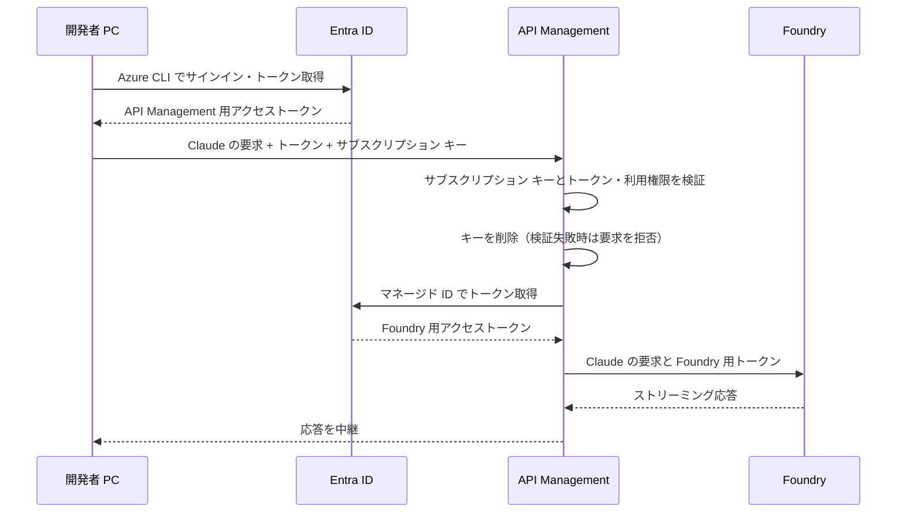

## 前提条件

本資料は Entra ID と APIM のサブスクリプション キーを併用する認証設定を中心に説明します。Foundry や APIM 自体のデプロイ手順、ネットワーク構成の詳細は対象外です。

- **Azure リソース**: APIM と、利用する Claude モデルをデプロイ済みの Foundry リソース。
- **管理者権限**: アプリ登録、スコープの事前承認、ユーザー・グループへのアプリ ロール割り当て、APIM の API 設定・サブスクリプション管理、および Foundry リソースへの Azure RBAC ロール割り当てに必要な権限。
- **開発端末**: Azure CLI と Claude Code をインストール済みの Windows PC。本資料のコマンド例は PowerShell 用です。
- **接続性**: 開発端末から Entra ID・APIM へ、APIM から Foundry へ接続できること。
- **ログ基盤（任意）**: ログを収集する場合は、Log Analytics ワークスペースと診断設定を変更する権限。

利用者は認証用アプリの `Claude.User` ロールに割り当て、手順 2.3 で発行する APIM のサブスクリプション キーを配布します。Foundry を呼び出す Azure RBAC 権限は APIM のマネージド ID に付与するため、この経路の利用だけであれば、利用者個人に Foundry リソースの権限を付与する必要はありません。

> [!NOTE]
> 画像は 2026-09-14 時点のポータル画面を基にしています。画面や選択肢は更新されるため、現在の表示と公式ドキュメントを確認してください。

## 1. Microsoft Entra ID の設定

### 1.1. 認証用アプリを登録する

Microsoft Entra ID の **アプリの登録** から、APIM にアクセスするための API を登録します。

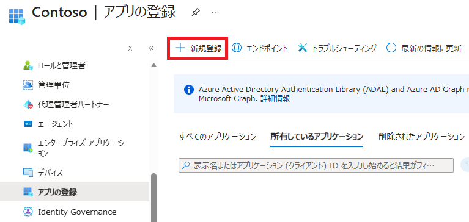

| 設定項目 | 設定例 |
| --- | --- |
| 名前 | `claude-gateway-api` |
| サポートされているアカウントの種類 | シングル テナント |
| リダイレクト URI（省略可能） | 設定不要 |

### 1.2. アプリとテナントの ID を控える

後続の設定例では、次のプレースホルダーを実際の GUID に置き換えます。

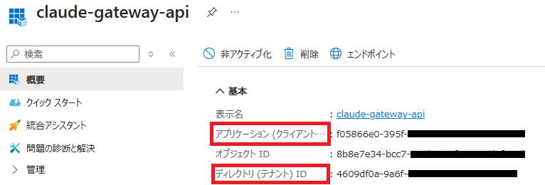

| ポータルの表示名 | 本資料のプレースホルダー |
| --- | --- |
| アプリケーション (クライアント) ID | `API_APP_ID` |
| ディレクトリ (テナント) ID | `TENANT_ID` |

### 1.3. API を公開し、スコープを追加する

**API の公開** で、アプリケーション ID URI を `api://API_APP_ID` に設定します。続いて、委任されたアクセス許可を表すスコープ `Claude.Invoke` を追加します。完全なスコープ名は `api://API_APP_ID/Claude.Invoke` です。

参考資料：[Web API を公開するようにアプリケーションを構成する](https://learn.microsoft.com/entra/identity-platform/quickstart-configure-app-expose-web-apis)

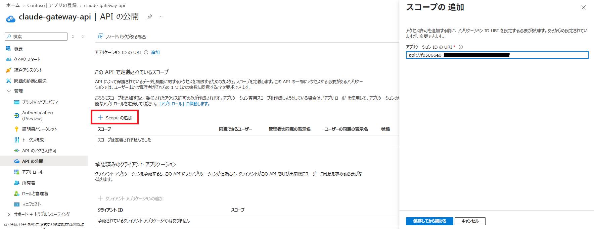

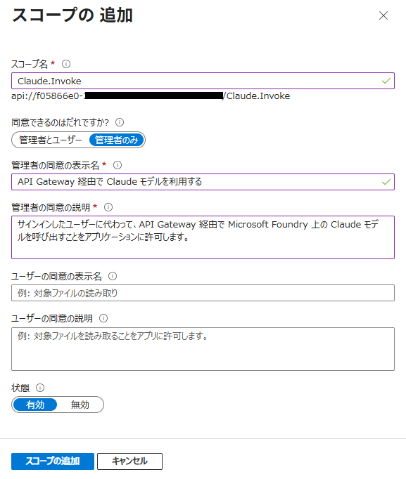

| 設定項目 | 設定例 |
| --- | --- |
| スコープ名 | `Claude.Invoke` |
| 同意できるユーザー | 管理者のみ |
| 管理者の同意の表示名 | `API Management 経由で Claude モデルを利用する` |
| 管理者の同意の説明 | `サインインしたユーザーに代わって、API Management 経由で Microsoft Foundry 上の Claude モデルを呼び出すことをアプリケーションに許可します。` |
| 状態 | 有効 |

### 1.4. Azure CLI をクライアントとして事前承認する

Azure CLI を認証クライアントとして使うため、API の公開画面にある **「承認済みのクライアント アプリケーション」** で、Azure CLI のクライアント ID `04b07795-8ddb-461a-bbee-02f9e1bf7b46` と `Claude.Invoke` を事前承認します。

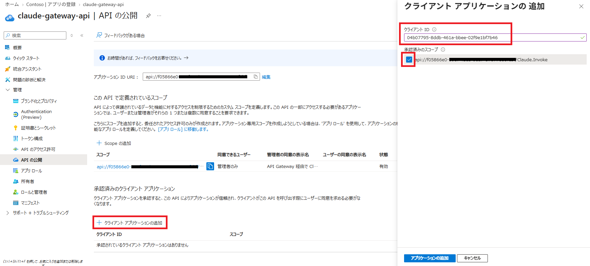

事前承認は Azure CLI によるスコープ利用への同意であり、すべてのユーザーにゲートウェイの利用権限を付与するものではありません。利用者の制限は、次のアプリ ロールと APIM ポリシーで行います。

### 1.5. アプリ ロールを作成し、利用者に割り当てる

アプリ ロール `Claude.User` を作成します。

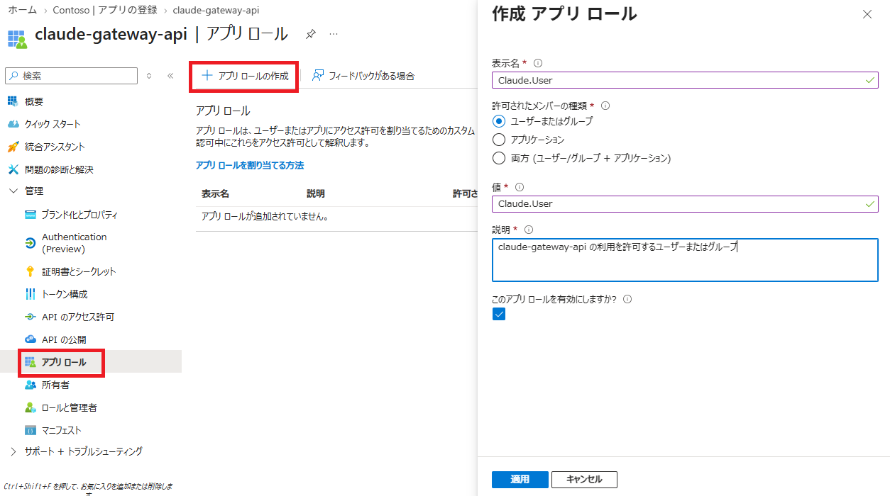

| 設定項目 | 設定例 |
| --- | --- |
| 表示名 | `Claude.User` |
| 許可されたメンバーの種類 | ユーザーまたはグループ |
| 値 | `Claude.User` |
| 説明 | `claude-gateway-api の利用を許可するユーザーまたはグループ` |

作成したアプリ ロールの画面で、**アプリ ロールを割り当てる方法**、**エンタープライズ アプリケーション** の順に進みます。

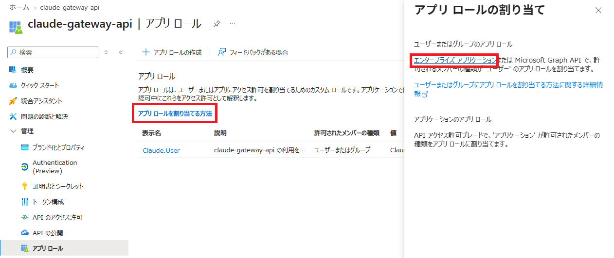

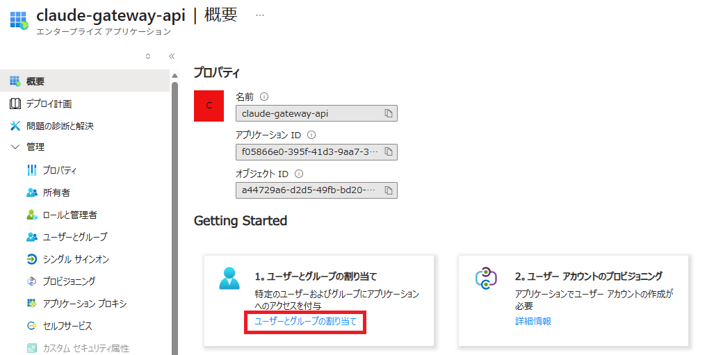

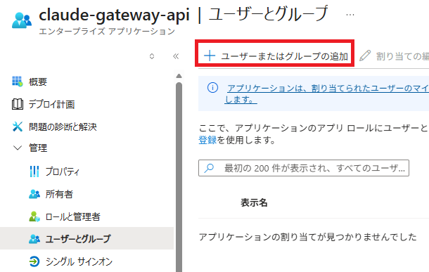

**ユーザーとグループ** で対象のユーザーまたはグループを追加し、`Claude.User` ロールを選択します。後続の APIM ポリシーは、アクセス トークンの `scp` に `Claude.Invoke`、`roles` に `Claude.User` が含まれることを検証します。

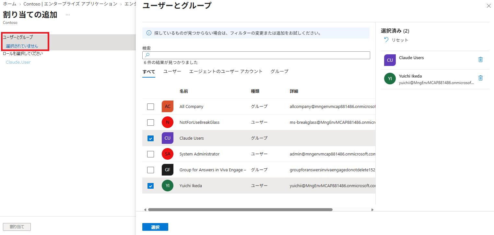

> [!NOTE]
> グループ単位の割り当てには Microsoft Entra ID P1 または P2 が必要です。入れ子のグループのメンバーには割り当てが継承されません。詳細は [ユーザーとグループのアプリへの割り当て](https://learn.microsoft.com/entra/identity/enterprise-apps/assign-user-or-group-access-portal) を参照してください。

参考資料：[アプリ ロールを追加してトークンで受け取る](https://learn.microsoft.com/entra/identity-platform/howto-add-app-roles-in-apps)

## 2. API Management の設定

### 2.1. Anthropic 互換 API をインポートする

[Microsoft Foundry API のインポート手順](https://learn.microsoft.com/ja-jp/azure/api-management/azure-ai-foundry-api#import-microsoft-foundry-api-by-using-the-portal) を参考に、対象の Foundry リソースを選択します。

Claude Code が使うのは **Anthropic Messages API** です。インポート後に、少なくとも `POST /anthropic/v1/messages` と `POST /anthropic/v1/messages/count_tokens` が対象の Foundry エンドポイントに転送されることを確認してください。`/chat/completions` のみの API では代用できません。

> [!NOTE]
> インポート画面で提供される API の種類は更新されます。参照先は Foundry API 全般の手順であり、Anthropic の操作が自動作成されることを保証するものではありません。不足する場合は、[Claude の API 仕様](https://learn.microsoft.com/azure/foundry/foundry-models/concepts/claude-models#api-overview) に従って操作とバックエンドへのルーティングを追加してください。

### 2.2. ユーザーのアクセス トークンを検証する

対象 API の **All operations** にある **inbound processing** からポリシー エディターを開きます。


以下は `inbound` と `backend` 部分の例です。`outbound` と `on-error` は既存の内容を保持してください。

- `inbound` で、開発者の Entra ID アクセス トークンを検証します。
- サブスクリプション キーの検証は手順 2.3 の API 設定で有効にします。以下のトークン検証ポリシーだけではキーは必須になりません。
- ストリーミング応答を利用するため、`backend` セクションで適用される `forward-request` に `buffer-response="false"` を設定します。既定値は `true` です。詳細は [forward-request ポリシー](https://learn.microsoft.com/azure/api-management/forward-request-policy) を参照してください。

```xml
<inbound>
    <base />

    <!-- クライアント認証 -->
    <validate-azure-ad-token
        tenant-id="TENANT_ID"
        header-name="Authorization"
        failed-validation-httpcode="401"
        failed-validation-error-message="Unauthorized"
        output-token-variable-name="callerJwt">

        <client-application-ids>
            <application-id>CLI_APP_ID</application-id>
        </client-application-ids>

        <audiences>
            <audience>API_APP_ID</audience>
            <audience>api://API_APP_ID</audience>
        </audiences>

        <required-claims>
            <claim name="scp" match="all" separator=" ">
                <value>Claude.Invoke</value>
            </claim>
            <claim name="roles" match="any">
                <value>Claude.User</value>
            </claim>
        </required-claims>
    </validate-azure-ad-token>

    <!-- バックエンドの Foundry へ不要なキー情報が送信されるのを防ぎます -->
    <set-header name="Ocp-Apim-Subscription-Key" exists-action="delete" />
    <set-header name="x-api-key" exists-action="delete" />
    <set-header name="api-key" exists-action="delete" />
    <set-query-parameter name="subscription-key" exists-action="delete" />

    <!-- インポート時に作成されたバックエンドを指定 -->
    <set-backend-service id="apim-generated-policy" backend-id="FOUNDRY_BACKEND_ID" />
</inbound>
<backend>
    <!-- ストリーミング応答を利用するため応答バッファを無効にします -->
    <forward-request buffer-response="false" />
</backend>
```

`TENANT_ID`、`CLI_APP_ID`、`API_APP_ID`、`FOUNDRY_BACKEND_ID` を以下の値に置き換えます。2 か所ある `API_APP_ID` には同じ GUID を設定してください。

| 設定項目 | 値 |
| --- | --- |
| `TENANT_ID` | ディレクトリ (テナント) ID |
| `CLI_APP_ID` | Azure CLI のクライアント ID: `04b07795-8ddb-461a-bbee-02f9e1bf7b46` |
| `API_APP_ID` | 認証用アプリのアプリケーション (クライアント) ID |
| `FOUNDRY_BACKEND_ID` | API インポート時に生成された `set-backend-service` の `backend-id` |

`aud` はトークンの宛先です。v2.0 トークンでは API のクライアント ID、v1.0 トークンではクライアント ID またはアプリケーション ID URI になります。この例は、同じ認証用アプリを表す `API_APP_ID` と `api://API_APP_ID` の両方を許可します。独自のアプリケーション ID URI を使用する場合は、後者をその URI に変更してください。詳細は [アクセス トークンのクレーム](https://learn.microsoft.com/entra/identity-platform/access-token-claims-reference) を参照してください。

`apiKeyHelper` と `ANTHROPIC_CUSTOM_HEADERS` を併用し、Entra ID トークンを `Authorization`、APIM のサブスクリプション キーを APIM 標準の `Ocp-Apim-Subscription-Key` ヘッダーで送信します。`apiKeyHelper` は取得したトークンを `Authorization` と `x-api-key` の両方に設定するため、`x-api-key` はサブスクリプション キーの受け渡しには使えません。APIM のサブスクリプション キー用ヘッダー名も、手順 2.3 で既定の `Ocp-Apim-Subscription-Key` にそろえます。

APIM は既定でサブスクリプション キーをバックエンドへ転送するため、検証後の `inbound` で `Ocp-Apim-Subscription-Key` と、代替の受け渡し方法である `subscription-key` クエリ パラメーターを削除します。`apiKeyHelper` が設定する `x-api-key` と、不要な `api-key` も削除し、Foundry 用の認証情報と混在させません。本資料では URL やアクセスログへの露出を避けるため、キーはクエリではなくヘッダーで送信します。

> [!IMPORTANT]
> `set-backend-service` は転送先を選択するポリシーであり、それだけでマネージド ID 認証を設定するものではありません。選択したバックエンドにマネージド ID 認証が設定され、ユーザーの `Authorization` が Foundry 用のトークンに置き換わることを確認してください。

インポート時に生成された認証設定を確認します。手動で設定する場合は、APIM のシステム割り当てマネージド ID を有効にし、対象の **Foundry リソースのスコープ** で `Foundry User`（旧称 `Azure AI User`）などのモデル呼び出し権限を付与します。`Cognitive Services User` でも呼び出せます。

Claude の Entra ID 認証で要求するスコープは `https://ai.azure.com/.default` です。バックエンド認証をポリシーで設定する場合は、ユーザーのトークン検証とキー用ヘッダーの削除より後の `inbound` に、次を追加します。生成済みの認証設定がある場合は重複させず、トークンの宛先を確認してください。

```xml
<authentication-managed-identity resource="https://ai.azure.com" />
```

このポリシーは `Authorization` をマネージド ID の Bearer トークンに置き換えます。ユーザー認証用の `api://API_APP_ID/Claude.Invoke` と、Foundry 呼び出し用のスコープを混同しないでください。

参考資料：[Claude の Entra ID 認証](https://learn.microsoft.com/azure/foundry/foundry-models/how-to/use-foundry-models-claude#call-the-claude-messages-api)、[Claude Code の Azure RBAC](https://learn.microsoft.com/azure/foundry/foundry-models/how-to/configure-claude-code#configure-azure-rbac)、[マネージド ID 認証ポリシー](https://learn.microsoft.com/azure/api-management/authentication-managed-identity-policy)

### 2.3. サブスクリプション キーを必須にし、利用者へ配布する

Entra ID 認証に加えて、**有効な APIM サブスクリプション キーを必須**にします。ここでいうサブスクリプションは APIM の API 利用契約であり、Azure の課金用サブスクリプションとは別のものです。

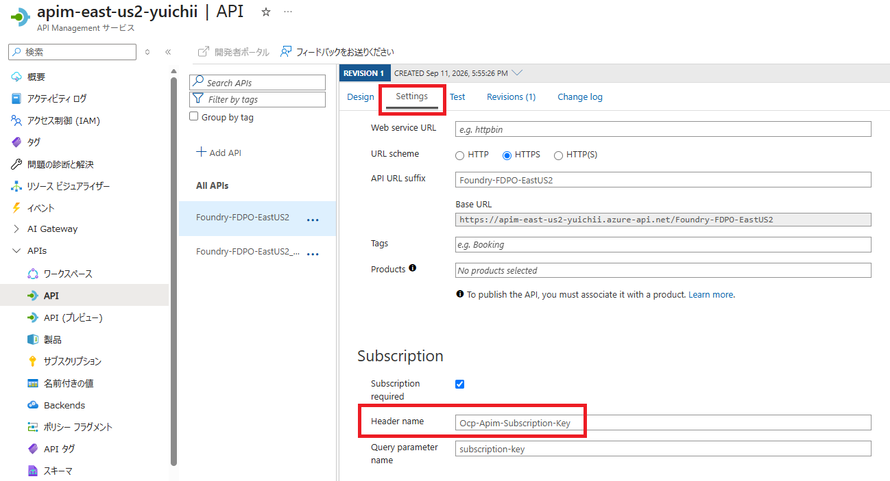

1. 対象 API の **Settings** で **Subscription required** を有効にし、**Header name** が APIM 標準の `Ocp-Apim-Subscription-Key` であることを確認します。インポート後に `api-key` などと表示されている場合は `Ocp-Apim-Subscription-Key` に変更して保存します。手順 3.2 の `ANTHROPIC_CUSTOM_HEADERS` で同じ名前のヘッダーを送信します。**Query parameter name** は `subscription-key` を維持します。
2. 対象 API に紐づくすべての製品で **Requires subscription** が有効であることを確認します。サブスクリプション不要の製品（open product）が紐づいている場合は、その設定を有効にするか対象 API との紐づけを解除します。API 側の設定だけでは、open product 経由のキーなしアクセスを防げません。
3. APIM の **Subscriptions** からサブスクリプションを作成し、**Scope** に対象の **API** を指定します。状態が **Active** であることを確認し、利用者やチームごとに識別できる名前を付けます。API スコープのサブスクリプションでは製品スコープのポリシーは適用されないため、手順 2.2 のトークン検証は必ず **API の All operations** に設定します。
4. 作成したサブスクリプションの **Primary key** または **Secondary key** のどちらか一方を、安全な方法で利用者に配布します。利用者は手順 3.2 の `ANTHROPIC_CUSTOM_HEADERS` に設定します。全 API にアクセスできる組み込みの **all-access** キーは配布しないでください。

キーだけでは Entra ID のユーザー認証や `Claude.User` ロールの確認を代替できません。また、この構成はキーの所有者とトークンの `oid` を照合しません。利用者とキーを厳密に紐づける場合は、別途その対応関係を検証するポリシーが必要です。

キーは定期的にローテーションします。利用していない側のキーを再生成して利用者の設定を切り替え、Claude Code を再起動して動作確認した後、古いキーを再生成します。利用停止時は対象サブスクリプションを停止するなどして無効化してください。共有キーの停止・再生成は、そのキーを使う全利用者に影響します。

参考資料：[APIM のサブスクリプション設定・キー管理](https://learn.microsoft.com/azure/api-management/api-management-subscriptions)

### 2.4. 追加の保護を検討する（任意）

以下は `inbound` に追加するポリシーの例です。値は利用実態に合わせて調整してください。

```xml
<!-- 社内ネットワークなど、許可する送信元を限定します -->
<ip-filter action="allow">
    <address-range from="203.0.113.0" to="203.0.113.255" />
</ip-filter>

<!-- サブスクリプションキー単位で要求数を制限します -->
<rate-limit-by-key calls="60" renewal-period="60" counter-key="@(context.Subscription.Id)" />
<quota-by-key calls="10000" renewal-period="86400" counter-key="@(context.Subscription.Id)" />
```

利用できるポリシーと上限値は、APIM のレベル（SKU）やゲートウェイの種類によって異なります。適用前に [レート制限](https://learn.microsoft.com/azure/api-management/rate-limit-by-key-policy)、[クォータ](https://learn.microsoft.com/azure/api-management/quota-by-key-policy)、[IP フィルター](https://learn.microsoft.com/azure/api-management/ip-filter-policy) の各ドキュメントで対応状況を確認してください。トークン使用量に基づく制限を適用する場合は、[AI Gateway の機能](https://learn.microsoft.com/azure/api-management/genai-gateway-capabilities) で、利用する API 種別への対応を確認します。

#### キーごとにバックエンドを振り分ける

キー（サブスクリプション）ごとに呼び出し先の Foundry を分けると、チームや用途の単位でモデルのデプロイ・リージョン・クォータを分離できます。利用者から見た接続先は同じ APIM のエンドポイントのままです。

あらかじめ APIM の **Backends** で 3 つのバックエンドを作成し、**Subscriptions** で 3 つのサブスクリプション（キー）を作成します。以下は、`choose` ポリシーでサブスクリプションを判定し、`set-backend-service` の転送先を切り替える例です。手順 2.2 の `set-backend-service` の代わりに、**同じ位置（キー用ヘッダーの削除より後）** へ記述します。

```xml
<!-- キー（サブスクリプション）ごとに転送先の Foundry を切り替えます -->
<choose>
    <when condition="@(context.Subscription.Id.Equals("claude-team-a"))">
        <set-backend-service backend-id="FOUNDRY_BACKEND_TEAM_A" />
    </when>
    <when condition="@(context.Subscription.Id.Equals("claude-team-b"))">
        <set-backend-service backend-id="FOUNDRY_BACKEND_TEAM_B" />
    </when>
    <when condition="@(context.Subscription.Id.Equals("claude-team-c"))">
        <set-backend-service backend-id="FOUNDRY_BACKEND_TEAM_C" />
    </when>
    <otherwise>
        <return-response>
            <set-status code="403" reason="Forbidden" />
            <set-header name="Content-Type" exists-action="override">
                <value>application/json</value>
            </set-header>
            <set-body>@{
                return "{ \"error\": { \"type\": \"forbidden\", \"message\": \"No backend is assigned to this subscription.\" } }";
            }</set-body>
        </return-response>
    </otherwise>
</choose>
```

| サブスクリプション（配布するキー） | `context.Subscription.Id` の値 | 転送先のバックエンド |
| --- | --- | --- |
| チーム A 用 | `claude-team-a` | `FOUNDRY_BACKEND_TEAM_A` |
| チーム B 用 | `claude-team-b` | `FOUNDRY_BACKEND_TEAM_B` |
| チーム C 用 | `claude-team-c` | `FOUNDRY_BACKEND_TEAM_C` |

- `context.Subscription.Id` は、サブスクリプション作成時の **Name**（リソース ID の末尾に表示される名前）です。一覧に表示される **Display name** は `context.Subscription.Name` で取得するため、値が異なる場合があります。判定に使う値は、実際のサブスクリプションの設定画面で確認してください。
- 条件にキーの値（`context.Subscription.Key`）を書かないでください。ポリシーに認証情報が残り、ローテーションのたびに編集が必要になります。
- 3 つのバックエンドすべてでマネージド ID 認証を設定し、APIM のマネージド ID に **各 Foundry リソース** のモデル呼び出し権限（`Foundry User` など）を割り当てます。ポリシーで設定する場合、リソースはいずれも `https://ai.azure.com` のため、`authentication-managed-identity` は 1 つで共通に使えます。
- モデルのデプロイ名は Foundry リソースごとに異なる場合があります。利用者へは、そのキーの転送先に存在するデプロイ名を `ANTHROPIC_DEFAULT_*_MODEL` として配布してください。`ANTHROPIC_BASE_URL` は 3 チームとも同じ値です。

参考資料：[choose ポリシー](https://learn.microsoft.com/azure/api-management/choose-policy)、[set-backend-service ポリシー](https://learn.microsoft.com/azure/api-management/set-backend-service-policy)、[API Management のバックエンド](https://learn.microsoft.com/azure/api-management/backends)

### 2.5. 利用状況のログを設定する

[言語モデル API のログ記録](https://learn.microsoft.com/ja-jp/azure/api-management/api-management-howto-llm-logs) を参考に、必要に応じて次を設定します。

1. APIM の診断設定で、AI Gateway のログを Log Analytics ワークスペースへ送信します。
2. 対象 API の診断設定で、必要な範囲のプロンプト・応答の記録を有効にします。
3. 利用者別の監査が必要な場合は、検証済みの `callerJwt` から取得した `tid` と `oid` を、要求 ID と APIM サブスクリプション ID（`context.Subscription.Id`）に関連付けて APIM 側に記録する処理を追加します。キーの値自体は記録しません。

**LLM ログを有効にするだけでは、Entra ID ユーザー別の集計は完成しません。** Foundry が認識する呼び出し元は APIM のマネージド ID です。この README の認証ポリシーには、ユーザー ID をログへ記録する処理は含まれていません。必要に応じて、検証済みの `callerJwt` から取得した識別情報を記録してください。

集計キーには、変更されない `oid` と `tid` の組み合わせを使用します。ユーザー名は変更される可能性があるため表示用途にとどめ、クレーム名はトークンのバージョンによって異なります（v1.0 は `upn`、v2.0 は `preferred_username`）。含まれるクレームは要求したスコープなどによっても変わるため、手順 4.1 で実際のトークンを確認してください。

利用するゲートウェイで Anthropic Messages API のトークン使用量やストリーミング応答が期待どおり記録されるか、実際のログで確認してください。

> [!WARNING]
> プロンプトや応答にはソースコード・機密情報・個人情報が含まれる可能性があります。保存対象、保持期間、閲覧権限、マスキング方針を事前に定めてください。`Authorization`、`Ocp-Apim-Subscription-Key`、`x-api-key` に含まれる認証情報はログへ記録しないでください。

## 3. 開発者 PC の設定

### 3.1. Azure CLI と Claude Code をインストールする

- Azure CLI が未インストールの場合は、[公式のインストール手順](https://learn.microsoft.com/ja-jp/cli/azure/install-azure-cli) に従ってインストールしてください。
- Claude Code が未インストールの場合は、[公式のインストール手順](https://code.claude.com/docs/ja/quickstart#step-1-install-claude-code) に従ってインストールしてください。

### 3.2. Claude Code のユーザー設定を追加する

本資料では、Claude Code の **汎用 LLM Gateway 接続**で、`apiKeyHelper` と `ANTHROPIC_CUSTOM_HEADERS` を併用します。Foundry への直接接続モードとは異なるため、`CLAUDE_CODE_USE_FOUNDRY` や `ANTHROPIC_FOUNDRY_*` は設定しません。既存のプロバイダー設定や、固定値の `ANTHROPIC_AUTH_TOKEN`・`ANTHROPIC_API_KEY` が残っていないことを確認してください。

`apiKeyHelper` と `ANTHROPIC_API_KEY` を同時に設定すると、Claude Code の起動時に次の警告が表示され、意図した認証情報が使われないことがあります。サブスクリプション キーは `ANTHROPIC_API_KEY` ではなく、カスタム ヘッダーとして送信します。

```text
Both apiKeyHelper and ANTHROPIC_API_KEY set · auth may not work as expected
```

ユーザー設定 `%USERPROFILE%\.claude\settings.json` に次の項目を追加します。既存の設定がある場合は、ファイル全体を上書きせず、各項目を統合してください。

```json
{
    "model": "sonnet",
    "apiKeyHelper": "az account get-access-token --tenant TENANT_ID --scope api://API_APP_ID/Claude.Invoke --query accessToken --output tsv --only-show-errors",
    "env": {
        "CLAUDE_CODE_DISABLE_ADVISOR_TOOL": "1",
        "ANTHROPIC_BASE_URL": "https://<APIM_NAME>.azure-api.net/<API_URL_SUFFIX>/anthropic",
        "ANTHROPIC_CUSTOM_HEADERS": "Ocp-Apim-Subscription-Key: <APIM_SUBSCRIPTION_KEY>",
        "ANTHROPIC_DEFAULT_SONNET_MODEL": "<Sonnet のデプロイ名>",
        "ANTHROPIC_DEFAULT_OPUS_MODEL": "<Opus のデプロイ名>",
        "ANTHROPIC_DEFAULT_HAIKU_MODEL": "<小規模タスク用のデプロイ名>",
        "CLAUDE_CODE_API_KEY_HELPER_TTL_MS": "240000"
    }
}
```

カスタムヘッダの設定は、以下のようになります。

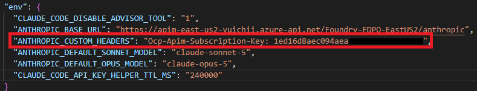

| 設定項目 | 値 |
| --- | --- |
| `TENANT_ID` | 手順 1.2 で控えたディレクトリ (テナント) ID |
| `API_APP_ID` | 手順 1.2 で控えたアプリケーション (クライアント) ID |
| `APIM_NAME` | APIM のサービス名。独自ドメインの場合はホスト名全体を変更 |
| `API_URL_SUFFIX` | 対象 API の **API URL suffix**。API の `Name` や表示名ではありません |
| `APIM_SUBSCRIPTION_KEY` | 手順 2.3 で配布された APIM の Primary key または Secondary key。Foundry の API キーではありません |
| 各モデルのデプロイ名 | Foundry に実在するデプロイ名。モデルの表示名ではありません |

`CLAUDE_CODE_DISABLE_ADVISOR_TOOL` は、[アドバイザー ツール](https://code.claude.com/docs/ja/advisor) を無効にする設定です。アドバイザーは Anthropic のインフラ上で実行されるサーバー ツールのため、**Microsoft Foundry のモデルでは利用できません**。

`apiKeyHelper` は Entra ID トークンの取得用、`ANTHROPIC_CUSTOM_HEADERS` は APIM サブスクリプション キーの送信用です。`ANTHROPIC_CUSTOM_HEADERS` は `ヘッダー名: 値` の形式で指定し、`Ocp-Apim-Subscription-Key: ` に続けてキーの値だけを記述します。`Bearer` は付けません。`ANTHROPIC_AUTH_TOKEN` と `ANTHROPIC_API_KEY` は設定せず、`apiKeyHelper` によるトークン取得を使用してください。詳細は [Claude Code の認証情報とヘッダーの対応](https://code.claude.com/docs/ja/llm-gateway-connect#how-the-credential-variable-maps-to-a-header)、[Claude Code が送信する要求ヘッダー](https://code.claude.com/docs/ja/llm-gateway-protocol#request-headers) を参照してください。

この組み合わせでは、トークンが `Authorization` と `x-api-key` の両方に、サブスクリプション キーが `Ocp-Apim-Subscription-Key` に送信されます。`x-api-key` のトークンは APIM のサブスクリプション キーとしては無効なため、手順 2.2 のポリシーで削除します。

**補足：`ANTHROPIC_CUSTOM_HEADERS` を使う理由（キー認証のみの構成との違い）**

キー認証のみの [APIM_KEY.md](APIM_KEY.md) では、Claude Code が送信する認証情報がサブスクリプション キーだけです。そのため、Claude Code 標準の認証情報変数である `ANTHROPIC_API_KEY` にキーを設定し、キーは `x-api-key` ヘッダーで送信されます。APIM 側の **Header name** も `x-api-key` に変更します。

本資料では、その認証情報の枠を Entra ID トークン（`apiKeyHelper`）が使用します。トークンは `Authorization` と `x-api-key` の両方に設定されるため、`x-api-key` をサブスクリプション キーの送信には使えません。そこでキーは `ANTHROPIC_CUSTOM_HEADERS` で APIM 標準の `Ocp-Apim-Subscription-Key` ヘッダーとして送信し、APIM 側の **Header name** も手順 2.3 で同じ名前にそろえます。

| 構成 | Entra ID トークンの送信 | サブスクリプション キーの送信 | APIM の Header name |
| --- | --- | --- | --- |
| [APIM_KEY.md](APIM_KEY.md)（キー認証のみ） | 使用しない | `ANTHROPIC_API_KEY` → `x-api-key` | `x-api-key` に変更 |
| 本資料（Entra ID + キー） | `apiKeyHelper` → `Authorization` | `ANTHROPIC_CUSTOM_HEADERS` → `Ocp-Apim-Subscription-Key` | APIM 標準の `Ocp-Apim-Subscription-Key` |

> [!NOTE]
> このヘッダーの分離は Claude Code 2.1.268 でダミーの認証情報を用いてローカル検証済みです。Azure 上での認証やトークン更新は、利用環境で確認してください。

> [!WARNING]
> この例ではユーザー設定にサブスクリプション キーが平文で保存されます。端末のアクセス権を制限し、設定ファイルをリポジトリへコミットしたり、チャット・Issue・共有ログへ貼り付けたりしないでください。ファイルへの保存を避ける場合は、設定の `ANTHROPIC_CUSTOM_HEADERS` を省略し、組織のシークレット管理の仕組みから起動プロセスの環境変数 `ANTHROPIC_CUSTOM_HEADERS` として渡してください。


画像の **Base URL** を基に、手順 2.1 の操作パスに合わせて `ANTHROPIC_BASE_URL` を設定します。この例では末尾に `/anthropic` を付け、Claude Code がその後ろに `/v1/messages` などを追加します。操作パスを変更した場合はそれに合わせて調整し、`/anthropic` や `/v1/messages` を重複させないでください。

小規模なバックグラウンド処理でも利用可能なモデルを指定してください。Haiku をデプロイしていない場合は、`ANTHROPIC_DEFAULT_HAIKU_MODEL` に利用可能な Sonnet のデプロイ名などを設定できますが、そのモデルの料金と性能が適用されます。Opus を利用する場合も、対応するデプロイが必要です。

### 3.3. トークンのキャッシュと再サインイン

`CLAUDE_CODE_API_KEY_HELPER_TTL_MS` は、[apiKeyHelper の出力をキャッシュする期間](https://code.claude.com/docs/ja/llm-gateway-connect#rotate-credentials-with-apikeyhelper) です。この例の `240000` ミリ秒は **240 秒（4 分）** に相当し、キャッシュの期限が切れた後、必要に応じてヘルパーを再実行します。

この設定は Entra ID トークンに対するもので、APIM のサブスクリプション キーは自動更新しません。キーをローテーションした場合は `ANTHROPIC_CUSTOM_HEADERS` も更新し、Claude Code を再起動してください。

[Azure CLI のコマンド リファレンス](https://learn.microsoft.com/cli/azure/account#az-account-get-access-token) では、取得したトークンは少なくとも 5 分間有効と説明されています。ここではヘルパーのキャッシュ期間を 4 分に抑えて余裕を持たせていますが、トークンの失効や再認証要求を防ぐ保証ではありません。

Azure CLI は有効なキャッシュを再利用し、必要に応じてトークンを更新します。ヘルパーを実行するたびに Entra ID へ通信するわけではなく、返されたトークンの残り有効期間や実際の通信間隔も一定ではありません。

リフレッシュ トークンの既定の有効期間は多くのシナリオで 90 日ですが、条件付きアクセスのサインイン頻度、管理者によるセッションの失効などで、それより前に再サインインが必要になる場合があります。詳細は [リフレッシュ トークンの有効期間と失効](https://learn.microsoft.com/entra/identity-platform/refresh-tokens) を参照してください。

### 3.4. サインインして Claude Code を起動する

初回、または再認証が必要になったときに、設定した API のテナントを指定してサインインします。`--allow-no-subscriptions` は、Azure サブスクリプションへの権限がない利用者もサインインできるようにする指定です。ユーザーの Entra ID アプリ ロールへの割り当ては必要です。

```powershell
az login --tenant TENANT_ID --allow-no-subscriptions
```

サインインに成功し、手順 3.2 のサブスクリプション キーを設定したら、作業対象のディレクトリで起動します。次回以降、サインイン状態とキーが有効であれば、このコマンドだけで利用できます。

```powershell
claude
```

この構成では `ANTHROPIC_API_KEY` を設定しないため、環境変数の API キーを使用するかどうかの確認は表示されません。起動時に `Both apiKeyHelper and ANTHROPIC_API_KEY set` の警告が表示される場合は、設定ファイルまたは環境変数に `ANTHROPIC_API_KEY` が残っています。手順 3.2 に従って削除し、Claude Code を再起動してください。

Claude Code の `/status` で APIM のベース URL と認証情報の取得元を確認し、短いプロンプトを送信して応答を確認してください。`Auth token` と `API key` は、どちらも取得元として `apiKeyHelper` と表示されます。サブスクリプション キーはカスタム ヘッダーで送信するため、`/status` には表示されません。

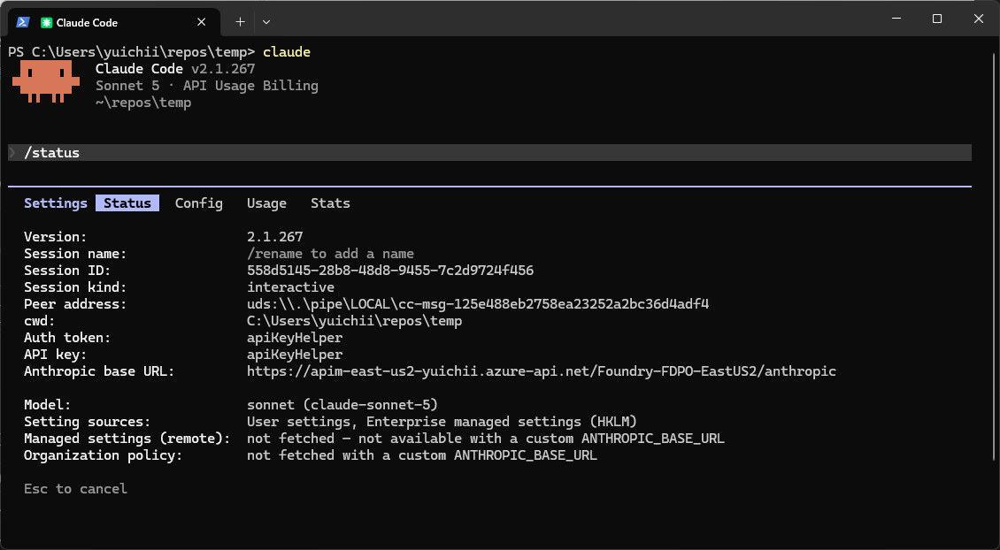

## 4. トラブルシューティング

**トークン取得、APIM への要求、Claude Code の設定** の順に確認すると、問題を切り分けやすくなります。以下の PowerShell 例は、同じターミナル セッションで順に実行してください。

### 4.1. アクセス トークンを取得し、クレームを確認する

アプリのスコープやロールを変更しても、発行済みのトークンの内容は変わりません。変更後のトークンを取得するには、必要に応じて `az logout` と `az login` でサインインし直します。設定の反映には時間がかかる場合があります。

> [!NOTE]
> `az account clear` はサブスクリプション情報のキャッシュを削除するコマンドで、サインアウトの代わりではありません。以下の `az logout` は現在の Azure CLI のサインイン状態に影響するため、通常の起動時には実行せず、認証をやり直す必要があるときだけ使用してください。

`TENANT_ID` と `API_APP_ID` を手順 1.2 の値に置き換えて実行します。

```powershell
$tenantId = "TENANT_ID"
$apiAppId = "API_APP_ID"
$scope = "api://$apiAppId/Claude.Invoke"

az logout

az login --tenant $tenantId --scope $scope --allow-no-subscriptions
if ($LASTEXITCODE -ne 0) {
    throw "Azure CLI へのサインインに失敗しました。"
}

$token = az account get-access-token `
    --tenant $tenantId `
    --scope $scope `
    --query accessToken `
    --output tsv `
    --only-show-errors

if ($LASTEXITCODE -ne 0 -or [string]::IsNullOrWhiteSpace($token)) {
    throw "アクセス トークンを取得できませんでした。"
}
```

続けて、`$token` のペイロードを端末内でデコードし、認証に関係するクレームを確認します。**デコードは署名検証ではありません。** トークンの署名・有効期限などの検証は APIM が行います。

```powershell
# Bearer が付いている場合は除去し、JWT を分割
$jwtParts = (([string]$token).Trim() -replace '^Bearer\s+', '').Split('.')

if ($jwtParts.Count -ne 3) {
    throw '$token に JWT 形式のアクセス トークンを設定してください。'
}

# ペイロードの Base64URL を通常の Base64 に変換
$payloadBase64 = $jwtParts[1].Replace('-', '+').Replace('_', '/')
$payloadBase64 += '=' * ((4 - ($payloadBase64.Length % 4)) % 4)

# デコードして JSON を整形表示
$claims = [System.Text.Encoding]::UTF8.GetString(
    [System.Convert]::FromBase64String($payloadBase64)
) | ConvertFrom-Json

$claims | ConvertTo-Json -Depth 20
```

以下の内容が含まれることを確認します。`aud` は `API_APP_ID` または設定済みのアプリケーション ID URI、`scp` は `Claude.Invoke` を含む文字列です。

```json
{
    "aud": "API_APP_ID",
    "tid": "TENANT_ID",
    "roles": ["Claude.User"],
    "scp": "Claude.Invoke"
}
```

さらに、`azp`（v2.0）または `appid`（v1.0）が Azure CLI のクライアント ID であり、`exp` が示す有効期限を過ぎていないことを確認してください。

> [!WARNING]
> アクセス トークンは有効期間内に API を呼び出せる認証情報です。チャット、Issue、公開ログなどへ貼り付けたり、リポジトリへ保存したりしないでください。クレームにも個人情報が含まれる場合があります。

### 4.2. APIM ポータルのテスト機能で確認する

APIM ポータルで対象 API の **Test** を開き、Anthropic Messages API の `POST /anthropic/v1/messages` を選択します。Claude Code を介さずに呼び出し、APIM・Foundry 側の問題か、Claude Code 側の設定の問題かを切り分けます。

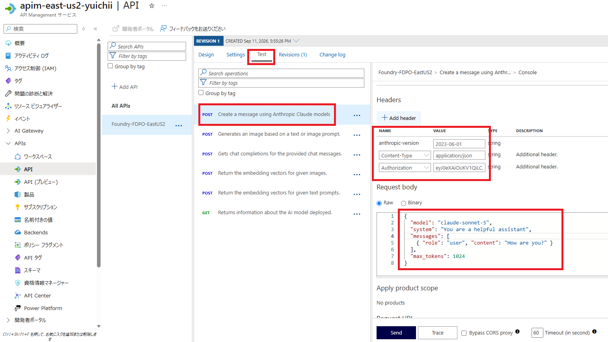

画像は操作場所を示す参考です。`Authorization`、サブスクリプション キー、モデルのデプロイ名は、以下の説明に従って入力してください。

| HTTP ヘッダー | 値 |
| --- | --- |
| `anthropic-version` | `2023-06-01` |
| `Content-Type` | `application/json` |
| `Authorization` | `Bearer <取得したアクセス トークン>` |
| `Ocp-Apim-Subscription-Key` | 手順 2.3 で配布された APIM のサブスクリプション キー |

`Authorization` には `Bearer` と半角スペースを付けます。ポータルは `$token` という文字列を PowerShell の変数として解釈しません。次のコマンドでヘッダー値をクリップボードにコピーできます。検証後はクリップボードと必要に応じてその履歴を消去してください。

```powershell
"Bearer $($token.Trim())" | Set-Clipboard
```

**Request body** の `model` を実在するデプロイ名に置き換えます。

```json
{
    "model": "<Sonnet のデプロイ名>",
    "system": "You are a helpful assistant",
    "messages": [
        { "role": "user", "content": "How are you?" }
    ],
    "max_tokens": 1024
}
```

ポータルのテスト機能がサブスクリプション キーを自動追加する場合があります。送信ヘッダー名が `Ocp-Apim-Subscription-Key` であり、組み込みの all-access キーではなく、手順 2.3 の対象 API 用のキーが使われていることを確認してください。次の組み合わせで、**両方の認証条件が必要**であることを検証します。

| Entra ID トークン | サブスクリプション キー | 期待する結果 |
| --- | --- | --- |
| 有効（スコープ・ロールあり） | 有効（対象 API・Active） | `200` で応答 |
| 有効 | なし | APIM が `401` で拒否 |
| 有効 | 不正・停止済み | APIM が `401` で拒否 |
| なし・期限切れ | 有効 | APIM が `401` で拒否 |
| スコープまたはロール不足 | 有効 | APIM が `401` で拒否 |
| なし | なし | APIM が `401` で拒否 |

キーなしのテストでは、自動追加されたヘッダーと URL の `subscription-key` の両方を除去してください。トークンなしのテストでは、ポータルが `Authorization` を自動追加していないことも確認します。`POST /anthropic/v1/messages/count_tokens` でも対応するリクエスト本文を使い、同じ認証条件を確認してください。

### 4.3. 一時的な環境変数で Claude Code を検証する

ユーザー設定をまだ追加していない検証環境では、手順 4.1 で取得した `$token` と、手順 2.3 で配布されたサブスクリプション キーを使って試せます。キーは入力プロンプトで受け取り、コマンド履歴に直接残さないようにします。ここでも手順 3 と同じ汎用 LLM Gateway 接続を使います。既存のユーザー・プロジェクト・管理設定が同じ環境変数を指定している場合は、そちらが優先されることがあるため、設定の競合を確認してください。

```powershell
if ([string]::IsNullOrWhiteSpace($token)) {
    throw "先に手順 4.1 でアクセス トークンを取得してください。"
}

$subscriptionKey = Read-Host "APIM サブスクリプション キー" -AsSecureString
if ($subscriptionKey.Length -eq 0) {
    throw "サブスクリプション キーを入力してください。"
}

$env:CLAUDE_CODE_USE_FOUNDRY = $null
$env:CLAUDE_CODE_USE_BEDROCK = $null
$env:CLAUDE_CODE_USE_VERTEX = $null
$env:CLAUDE_CODE_DISABLE_ADVISOR_TOOL = "1"
$env:ANTHROPIC_API_KEY = $null
$env:ANTHROPIC_BASE_URL = "https://<APIM_NAME>.azure-api.net/<API_URL_SUFFIX>/anthropic"
$env:ANTHROPIC_AUTH_TOKEN = $token.Trim()
$env:ANTHROPIC_CUSTOM_HEADERS = "Ocp-Apim-Subscription-Key: " + [System.Net.NetworkCredential]::new('', $subscriptionKey).Password

$env:ANTHROPIC_DEFAULT_SONNET_MODEL = "<Sonnet のデプロイ名>"
$env:ANTHROPIC_DEFAULT_OPUS_MODEL = "<Opus のデプロイ名>"
$env:ANTHROPIC_DEFAULT_HAIKU_MODEL = "<小規模タスク用のデプロイ名>"

claude --model sonnet
```

この方法はトークンの固定値を渡すため、**有効期限が切れても自動更新されません**。キーも最終的にはプロセスの環境変数に平文で設定されます。長時間の利用には手順 3 の `apiKeyHelper` とキーの設定を使い、検証終了後はこの PowerShell セッションを閉じて一時設定を解除してください。

### 4.4. エラー別の確認箇所

| 症状 | 主な確認箇所 |
| --- | --- |
| トークンを取得できない | サインイン先テナント、アプリケーション ID URI、スコープの事前承認、条件付きアクセス |
| APIM で `401`（キー不足・不正） | APIM の Header name が `Ocp-Apim-Subscription-Key` か、`ANTHROPIC_CUSTOM_HEADERS` のヘッダー名と値、キーの再生成有無、サブスクリプションの Scope と Active 状態 |
| 起動時に `Both apiKeyHelper and ANTHROPIC_API_KEY set` の警告 | 設定ファイルや環境変数に残った `ANTHROPIC_API_KEY`。この構成ではキーを `ANTHROPIC_CUSTOM_HEADERS` で送信します |
| APIM で `401`（トークン検証） | `Authorization`、`aud`、`scp`、`roles`、クライアント ID、有効期限。このポリシー例ではロール不足も `401` |
| キーなしで成功してしまう | API の Subscription required、紐づく製品の Requires subscription、ポータルの自動追加ヘッダー、URL の subscription-key |
| Foundry から `401` / `403` | APIM のマネージド ID、Foundry リソースへの RBAC 割り当て、トークンの宛先、ネットワーク制限 |
| `404` | API URL suffix、`/anthropic` を含む操作パス、Foundry のデプロイ名 |
| 応答が最後まで表示されない | ストリーミング応答のバッファリング、タイムアウト、途中のプロキシ |
| 未対応フィールドを示す `400` | Claude Code と Foundry の API 機能の差異。[Gateway のエラー対処](https://code.claude.com/docs/ja/llm-gateway-connect#troubleshoot-gateway-errors) を参照 |

APIM のトレースを確認する場合も、ユーザーやマネージド ID のアクセス トークン、サブスクリプション キー、プロンプト内の機密情報を共有しないでください。