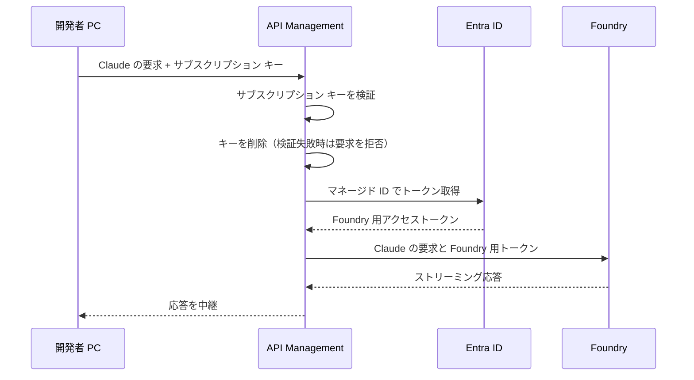
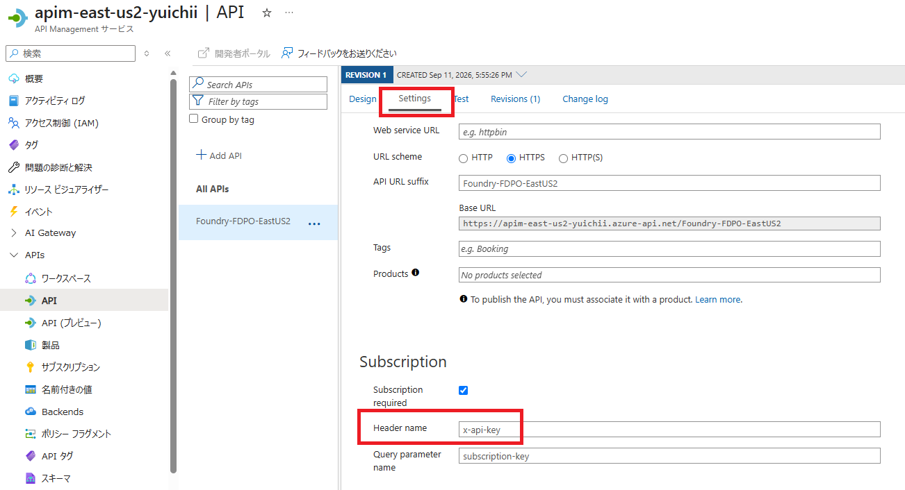
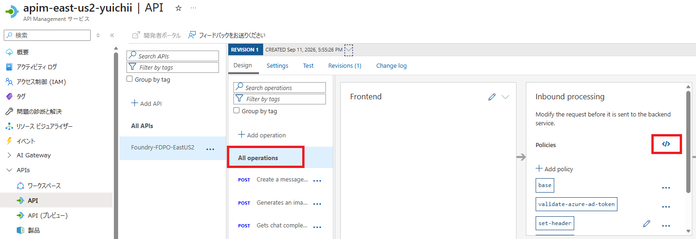
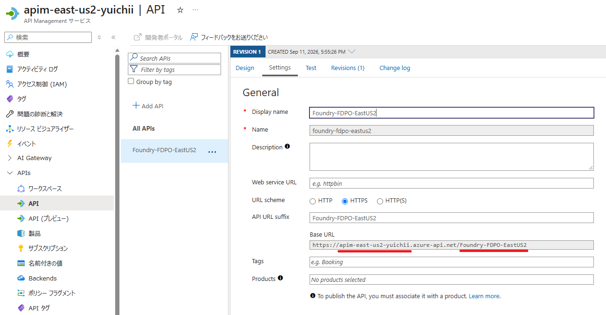
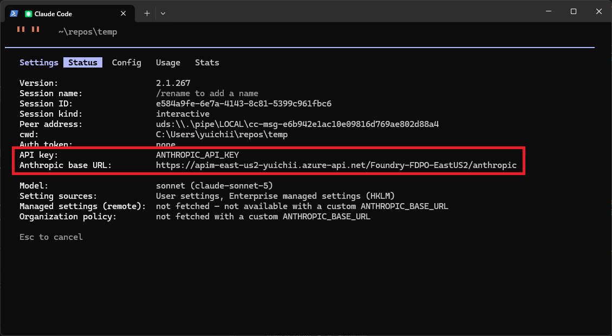

# Claude Code から Microsoft Foundry の Claude モデルを利用する（サブスクリプション キー）

## はじめに

開発者個人が Claude Code から Microsoft Foundry の Claude モデルを直接利用する場合は、[Microsoft の公式ドキュメント](https://learn.microsoft.com/azure/foundry/foundry-models/how-to/configure-claude-code) を参照してください。

本資料は、**IT 基盤部門による組織への導入**を想定しています。[Azure API Management](https://azure.microsoft.com/ja-jp/products/api-management)（以下、APIM）を AI Gateway として利用し、**APIM のサブスクリプション キー**でアクセスを制御する構成、および利用状況を監査する際の注意点を紹介します。本資料ではMicrosoft Entra ID によるユーザー認証は行いません。

## 目次

- [概要](#概要)
- [前提条件](#前提条件)
- [1. API Management の設定](#1-api-management-の設定)
- [2. 開発者 PC の設定](#2-開発者-pc-の設定)
- [3. トラブルシューティング](#3-トラブルシューティング)

## 概要

この構成では、Claude Code が各要求に `ANTHROPIC_API_KEY` に設定した `x-api-key: <サブスクリプション キー>` を付けて APIM を呼び出します。利用者のサインイン操作は不要で、キーを設定すれば `claude` コマンドだけで利用できます。キーを `ANTHROPIC_API_KEY` で渡す理由と、Entra ID 認証を併用する構成との違いは [手順 2.2](#22-claude-code-のユーザー設定を追加する) を参照してください。

APIM は、サブスクリプション キーの有効性と対象 API へのアクセス可否を検証します。**検証に成功した要求だけ**を、**APIM 自身のマネージド ID** で Foundry に転送します。利用者のキーをそのまま Foundry に転送する構成ではありません。



> [!IMPORTANT]
> この構成が識別するのは **キーの所有者** であり、利用者個人ではありません。キーを入手した人は誰でもゲートウェイを利用できます。条件付きアクセスや多要素認証、ユーザー・グループ単位の利用権限も適用されません。利用者やチームごとにサブスクリプションを分けて配布し、失効と監査の単位をそろえてください。ユーザー単位の認証が必要な場合は [APIM_Entra_ID_KEY.md](APIM_Entra_ID_KEY.md) の構成を検討してください。

## 前提条件

本資料は APIM のサブスクリプション キーによる認証設定を中心に説明します。Foundry や APIM 自体のデプロイ手順、ネットワーク構成の詳細は対象外です。

- **Azure リソース**: APIM と、利用する Claude モデルをデプロイ済みの Foundry リソース。
- **管理者権限**: APIM の API 設定・サブスクリプション管理・マネージド ID の有効化、および Foundry リソースへの Azure RBAC ロール割り当てに必要な権限。
- **開発端末**: Claude Code をインストール済みの Windows PC。本資料のコマンド例は PowerShell 用です。利用者の `az login` は不要です。
- **接続性**: 開発端末から APIM へ、APIM から Entra ID・Foundry へ接続できること。
- **ログ基盤（任意）**: ログを収集する場合は、Log Analytics ワークスペースと診断設定を変更する権限。

利用者には、手順 1.2 で発行する APIM のサブスクリプション キーを配布します。Foundry を呼び出す Azure RBAC 権限は APIM のマネージド ID に付与するため、この経路の利用だけであれば、利用者個人に Foundry リソースの権限を付与する必要はありません。

> [!NOTE]
> 画像は 2026-09-14 時点のポータル画面を基にしています。画面や選択肢は更新されるため、現在の表示と公式ドキュメントを確認してください。

## 1. API Management の設定

### 1.1. Anthropic 互換 API をインポートする

[Microsoft Foundry API のインポート手順](https://learn.microsoft.com/ja-jp/azure/api-management/azure-ai-foundry-api#import-microsoft-foundry-api-by-using-the-portal) を参考に、対象の Foundry リソースを選択します。

Claude Code が使うのは **Anthropic Messages API** です。インポート後に、少なくとも `POST /anthropic/v1/messages` と `POST /anthropic/v1/messages/count_tokens` が対象の Foundry エンドポイントに転送されることを確認してください。`/chat/completions` のみの API では代用できません。

> [!NOTE]
> インポート画面で提供される API の種類は更新されます。参照先は Foundry API 全般の手順であり、Anthropic の操作が自動作成されることを保証するものではありません。不足する場合は、[Claude の API 仕様](https://learn.microsoft.com/azure/foundry/foundry-models/concepts/claude-models#api-overview) に従って操作とバックエンドへのルーティングを追加してください。

### 1.2. サブスクリプション キーを必須にし、利用者へ配布する

**有効な APIM サブスクリプション キー**を、この構成の唯一の認証手段として必須にします。ここでいうサブスクリプションは APIM の API 利用契約であり、Azure の課金用サブスクリプションとは別のものです。



1. 対象 API の **Settings** で **Subscription required** を有効にし、**Header name** を `x-api-key` に変更して保存します。インポート後に `api-key` と表示されている場合も変更が必要です。`ANTHROPIC_API_KEY` は `x-api-key` ヘッダーで送信されるため、APIM 側の名前を一致させます。**Query parameter name** は `subscription-key` を維持します。
2. 対象 API に紐づくすべての製品で **Requires subscription** が有効であることを確認します。サブスクリプション不要の製品（open product）が紐づいている場合は、その設定を有効にするか対象 API との紐づけを解除します。API 側の設定だけでは、open product 経由のキーなしアクセスを防げません。
3. APIM の **Subscriptions** からサブスクリプションを作成し、**Scope** に対象の **API** を指定します。状態が **Active** であることを確認し、利用者やチームごとに識別できる名前を付けます。API スコープのサブスクリプションでは製品スコープのポリシーは適用されないため、手順 1.3 のポリシーは必ず **API の All operations** に設定します。
4. 作成したサブスクリプションの **Primary key** または **Secondary key** のどちらか一方を、安全な方法で利用者に配布します。利用者は手順 2.2 の `ANTHROPIC_API_KEY` に設定します。全 API にアクセスできる組み込みの **all-access** キーは配布しないでください。

キーは定期的にローテーションします。利用していない側のキーを再生成して利用者の設定を切り替え、Claude Code を再起動して動作確認した後、古いキーを再生成します。利用停止時は対象サブスクリプションを停止するなどして無効化してください。共有キーの停止・再生成は、そのキーを使う全利用者に影響します。

> [!WARNING]
> サブスクリプション キーは、それ単体でゲートウェイを利用できる認証情報です。チャット、Issue、公開ログなどへ貼り付けたり、リポジトリへコミットしたりしないでください。共有の範囲を最小にし、退職・異動・漏えいの疑いがある場合は速やかに再生成してください。

参考資料：[APIM のサブスクリプション設定・キー管理](https://learn.microsoft.com/azure/api-management/api-management-subscriptions)

### 1.3. ポリシーでキーを削除し、マネージド ID で Foundry を呼び出す

対象 API の **All operations** にある **inbound processing** からポリシー エディターを開きます。



以下は `inbound` と `backend` 部分の例です。`outbound` と `on-error` は既存の内容を保持してください。

- サブスクリプション キーの検証は手順 1.2 の API 設定で行われます。ポリシーでの追加検証は不要です。
- `inbound` で、クライアントから届いた認証情報用のヘッダーを削除し、バックエンドの Foundry へ転送されないようにします。
- ストリーミング応答を利用するため、`backend` セクションで適用される `forward-request` に `buffer-response="false"` を設定します。既定値は `true` です。詳細は [forward-request ポリシー](https://learn.microsoft.com/azure/api-management/forward-request-policy) を参照してください。

```xml
<inbound>
    <base />

    <!-- バックエンドの Foundry へ不要な認証情報が送信されるのを防ぎます -->
    <set-header name="x-api-key" exists-action="delete" />
    <set-header name="api-key" exists-action="delete" />
    <set-header name="Authorization" exists-action="delete" />
    <set-query-parameter name="subscription-key" exists-action="delete" />

    <!-- インポート時に作成されたバックエンドを指定 -->
    <set-backend-service id="apim-generated-policy" backend-id="FOUNDRY_BACKEND_ID" />
</inbound>
<backend>
    <!-- ストリーミング応答を利用するため応答バッファを無効にします -->
    <forward-request buffer-response="false" />
</backend>
```

`FOUNDRY_BACKEND_ID` を以下の値に置き換えます。

| 設定項目 | 値 |
| --- | --- |
| `FOUNDRY_BACKEND_ID` | API インポート時に生成された `set-backend-service` の `backend-id` |

APIM は既定でサブスクリプション キーをバックエンドへ転送するため、`inbound` で `x-api-key` と、代替の受け渡し方法である `subscription-key` クエリ パラメーターを削除します。不要な `api-key` と、クライアントが独自に付けた `Authorization` も削除し、Foundry 用の認証情報と混在させません。本資料では URL やアクセスログへの露出を避けるため、キーはクエリではなくヘッダーで送信します。

> [!IMPORTANT]
> `set-backend-service` は転送先を選択するポリシーであり、それだけでマネージド ID 認証を設定するものではありません。選択したバックエンドにマネージド ID 認証が設定され、Foundry 用のトークンが `Authorization` に設定されることを確認してください。

インポート時に生成された認証設定を確認します。手動で設定する場合は、APIM のシステム割り当てマネージド ID を有効にし、対象の **Foundry リソースのスコープ** で `Foundry User`（旧称 `Azure AI User`）などのモデル呼び出し権限を付与します。`Cognitive Services User` でも呼び出せます。

Claude の Entra ID 認証で要求するスコープは `https://ai.azure.com/.default` です。バックエンド認証をポリシーで設定する場合は、キー用ヘッダーの削除より後の `inbound` に、次を追加します。生成済みの認証設定がある場合は重複させず、トークンの宛先を確認してください。

```xml
<authentication-managed-identity resource="https://ai.azure.com" />
```

このポリシーは `Authorization` をマネージド ID のアクセス トークンに設定します。利用者のサブスクリプション キーは Foundry へ渡りません。

参考資料：[Claude の Entra ID 認証](https://learn.microsoft.com/azure/foundry/foundry-models/how-to/use-foundry-models-claude#call-the-claude-messages-api)、[Claude Code の Azure RBAC](https://learn.microsoft.com/azure/foundry/foundry-models/how-to/configure-claude-code#configure-azure-rbac)、[マネージド ID 認証ポリシー](https://learn.microsoft.com/azure/api-management/authentication-managed-identity-policy)

### 1.4. 追加の保護を検討する（任意）

キーのみの認証ではユーザー単位の制御ができないため、キーが漏えいした場合の影響を抑える対策を併用します。以下は `inbound` に追加するポリシーの例です。値は利用実態に合わせて調整してください。

```xml
<!-- 社内ネットワークなど、許可する送信元を限定します -->
<ip-filter action="allow">
    <address-range from="203.0.113.0" to="203.0.113.255" />
</ip-filter>

<!-- サブスクリプションキー単位で要求数を制限します -->
<rate-limit-by-key calls="60" renewal-period="60" counter-key="@(context.Subscription.Id)" />
<quota-by-key calls="10000" renewal-period="86400" counter-key="@(context.Subscription.Id)" />
```

利用できるポリシーと上限値は、APIM のレベル（SKU）やゲートウェイの種類によって異なります。適用前に [レート制限](https://learn.microsoft.com/azure/api-management/rate-limit-by-key-policy)、[クォータ](https://learn.microsoft.com/azure/api-management/quota-by-key-policy)、[IP フィルター](https://learn.microsoft.com/azure/api-management/ip-filter-policy) の各ドキュメントで対応状況を確認してください。トークン使用量に基づく制限を適用する場合は、[AI Gateway の機能](https://learn.microsoft.com/azure/api-management/genai-gateway-capabilities) で、利用する API 種別への対応を確認します。

#### キーごとにバックエンドを振り分ける

キー（サブスクリプション）ごとに呼び出し先の Foundry を分けると、チームや用途の単位でモデルのデプロイ・リージョン・クォータを分離できます。利用者から見た接続先は同じ APIM のエンドポイントのままです。

あらかじめ APIM の **Backends** で 3 つのバックエンドを作成し、**Subscriptions** で 3 つのサブスクリプション（キー）を作成します。以下は、`choose` ポリシーでサブスクリプションを判定し、`set-backend-service` の転送先を切り替える例です。手順 1.3 の `set-backend-service` の代わりに、**同じ位置（キー用ヘッダーの削除より後）** へ記述します。

```xml
<!-- キー（サブスクリプション）ごとに転送先の Foundry を切り替えます -->
<choose>
    <when condition="@(context.Subscription.Id.Equals("claude-team-a"))">
        <set-backend-service backend-id="FOUNDRY_BACKEND_TEAM_A" />
    </when>
    <when condition="@(context.Subscription.Id.Equals("claude-team-b"))">
        <set-backend-service backend-id="FOUNDRY_BACKEND_TEAM_B" />
    </when>
    <when condition="@(context.Subscription.Id.Equals("claude-team-c"))">
        <set-backend-service backend-id="FOUNDRY_BACKEND_TEAM_C" />
    </when>
    <otherwise>
        <return-response>
            <set-status code="403" reason="Forbidden" />
            <set-header name="Content-Type" exists-action="override">
                <value>application/json</value>
            </set-header>
            <set-body>@{
                return "{ \"error\": { \"type\": \"forbidden\", \"message\": \"No backend is assigned to this subscription.\" } }";
            }</set-body>
        </return-response>
    </otherwise>
</choose>
```

| サブスクリプション（配布するキー） | `context.Subscription.Id` の値 | 転送先のバックエンド |
| --- | --- | --- |
| チーム A 用 | `claude-team-a` | `FOUNDRY_BACKEND_TEAM_A` |
| チーム B 用 | `claude-team-b` | `FOUNDRY_BACKEND_TEAM_B` |
| チーム C 用 | `claude-team-c` | `FOUNDRY_BACKEND_TEAM_C` |

- `context.Subscription.Id` は、サブスクリプション作成時の **Name**（リソース ID の末尾に表示される名前）です。一覧に表示される **Display name** は `context.Subscription.Name` で取得するため、値が異なる場合があります。判定に使う値は、実際のサブスクリプションの設定画面で確認してください。
- 条件にキーの値（`context.Subscription.Key`）を書かないでください。ポリシーに認証情報が残り、ローテーションのたびに編集が必要になります。
- 3 つのバックエンドすべてでマネージド ID 認証を設定し、APIM のマネージド ID に **各 Foundry リソース** のモデル呼び出し権限（`Foundry User` など）を割り当てます。ポリシーで設定する場合、リソースはいずれも `https://ai.azure.com` のため、`authentication-managed-identity` は 1 つで共通に使えます。
- モデルのデプロイ名は Foundry リソースごとに異なる場合があります。利用者へは、そのキーの転送先に存在するデプロイ名を `ANTHROPIC_DEFAULT_*_MODEL` として配布してください。`ANTHROPIC_BASE_URL` は 3 チームとも同じ値です。

参考資料：[choose ポリシー](https://learn.microsoft.com/azure/api-management/choose-policy)、[set-backend-service ポリシー](https://learn.microsoft.com/azure/api-management/set-backend-service-policy)、[API Management のバックエンド](https://learn.microsoft.com/azure/api-management/backends)

### 1.5. 利用状況のログを設定する

[言語モデル API のログ記録](https://learn.microsoft.com/ja-jp/azure/api-management/api-management-howto-llm-logs) を参考に、必要に応じて次を設定します。

1. APIM の診断設定で、AI Gateway のログを Log Analytics ワークスペースへ送信します。
2. 対象 API の診断設定で、必要な範囲のプロンプト・応答の記録を有効にします。
3. 利用者別の集計が必要な場合は、APIM サブスクリプション ID（`context.Subscription.Id`）や名前を要求 ID に関連付けて記録します。キーの値自体は記録しません。

**この構成では、集計できる単位は APIM のサブスクリプションまでです。** Entra ID のユーザー ID は要求に含まれないため、利用者個人まで特定することはできません。Foundry が認識する呼び出し元も APIM のマネージド ID です。利用者ごとの内訳が必要な場合は、利用者ごとにサブスクリプションを分けるか、[APIM_Entra_ID_KEY.md](APIM_Entra_ID_KEY.md) の構成を検討してください。

利用するゲートウェイで Anthropic Messages API のトークン使用量やストリーミング応答が期待どおり記録されるか、実際のログで確認してください。

> [!WARNING]
> プロンプトや応答にはソースコード・機密情報・個人情報が含まれる可能性があります。保存対象、保持期間、閲覧権限、マスキング方針を事前に定めてください。`x-api-key` に含まれる認証情報はログへ記録しないでください。

## 2. 開発者 PC の設定

### 2.1. Claude Code をインストールする

Claude Code が未インストールの場合は、[公式のインストール手順](https://code.claude.com/docs/ja/quickstart#step-1-install-claude-code) に従ってインストールしてください。この構成では利用者の Azure CLI でのサインインは不要です。

### 2.2. Claude Code のユーザー設定を追加する

本資料では、Claude Code の **汎用 LLM Gateway 接続**で `ANTHROPIC_API_KEY` を使用します。Foundry への直接接続モードとは異なるため、`CLAUDE_CODE_USE_FOUNDRY` や `ANTHROPIC_FOUNDRY_*` は設定しません。既存のプロバイダー設定や、`apiKeyHelper`、`ANTHROPIC_AUTH_TOKEN`、`ANTHROPIC_CUSTOM_HEADERS` による認証ヘッダー設定が残っていないことを、設定ファイルと環境変数の両方で確認してください。

ユーザー設定 `%USERPROFILE%\.claude\settings.json` に次の項目を追加します。既存の設定がある場合は、ファイル全体を上書きせず、各項目を統合してください。

```json
{
    "model": "sonnet",
    "env": {
        "CLAUDE_CODE_DISABLE_ADVISOR_TOOL": "1",
        "ANTHROPIC_BASE_URL": "https://<APIM_NAME>.azure-api.net/<API_URL_SUFFIX>/anthropic",
        "ANTHROPIC_API_KEY": "<APIM_SUBSCRIPTION_KEY>",
        "ANTHROPIC_DEFAULT_SONNET_MODEL": "<Sonnet のデプロイ名>",
        "ANTHROPIC_DEFAULT_OPUS_MODEL": "<Opus のデプロイ名>",
        "ANTHROPIC_DEFAULT_HAIKU_MODEL": "<小規模タスク用のデプロイ名>"
    }
}
```

| 設定項目 | 値 |
| --- | --- |
| `APIM_NAME` | APIM のサービス名。独自ドメインの場合はホスト名全体を変更 |
| `API_URL_SUFFIX` | 対象 API の **API URL suffix**。API の `Name` や表示名ではありません |
| `APIM_SUBSCRIPTION_KEY` | 手順 1.2 で配布された APIM の Primary key または Secondary key。Foundry の API キーではありません |
| 各モデルのデプロイ名 | Foundry に実在するデプロイ名。モデルの表示名ではありません |

`CLAUDE_CODE_DISABLE_ADVISOR_TOOL` は、[アドバイザー ツール](https://code.claude.com/docs/ja/advisor) を無効にする設定です。アドバイザーは Anthropic のインフラ上で実行されるサーバー ツールのため、**Microsoft Foundry のモデルでは利用できません**。

`ANTHROPIC_API_KEY` にはキーの値だけを設定し、`Bearer` や `x-api-key:` は付けません。この設定では、キーが `x-api-key` ヘッダーで送信されます。詳細は [Claude Code の認証情報とヘッダーの対応](https://code.claude.com/docs/ja/llm-gateway-connect#how-the-credential-variable-maps-to-a-header) を参照してください。

**補足：`ANTHROPIC_API_KEY` を使う理由（Entra ID 認証を併用する構成との違い）**

この構成で Claude Code が送信する認証情報は、APIM のサブスクリプション キーだけです。そのため、Claude Code 標準の認証情報変数である `ANTHROPIC_API_KEY` にキーをそのまま設定でき、キーは `x-api-key` ヘッダーで送信されます。手順 1.2 で APIM の **Header name** を `x-api-key` に変更するのは、この送信先ヘッダーに合わせるためです。

一方、[APIM_Entra_ID_KEY.md](APIM_Entra_ID_KEY.md) では、`apiKeyHelper` が取得した Entra ID トークンが `Authorization` と `x-api-key` の両方に設定されます。`x-api-key` がトークンで占有されるうえ、`apiKeyHelper` と `ANTHROPIC_API_KEY` を同時に設定すると `Both apiKeyHelper and ANTHROPIC_API_KEY set` の警告が表示されます。このため、サブスクリプション キーは `ANTHROPIC_CUSTOM_HEADERS` を使い、APIM 標準の `Ocp-Apim-Subscription-Key` ヘッダーで送信します。

| 構成 | Entra ID トークンの送信 | サブスクリプション キーの送信 | APIM の Header name |
| --- | --- | --- | --- |
| 本資料（キー認証のみ） | 使用しない | `ANTHROPIC_API_KEY` → `x-api-key` | `x-api-key` に変更 |
| [APIM_Entra_ID_KEY.md](APIM_Entra_ID_KEY.md)（Entra ID + キー） | `apiKeyHelper` → `Authorization` | `ANTHROPIC_CUSTOM_HEADERS` → `Ocp-Apim-Subscription-Key` | APIM 標準の `Ocp-Apim-Subscription-Key` |

> [!WARNING]
> この例ではユーザー設定にサブスクリプション キーが平文で保存されます。端末のアクセス権を制限し、設定ファイルをリポジトリへコミットしたり、チャット・Issue・共有ログへ貼り付けたりしないでください。ファイルへの保存を避ける場合は、設定の `ANTHROPIC_API_KEY` を省略し、組織のシークレット管理の仕組みから起動プロセスの環境変数 `ANTHROPIC_API_KEY` として渡してください。



画像の **Base URL** を基に、手順 1.1 の操作パスに合わせて `ANTHROPIC_BASE_URL` を設定します。この例では末尾に `/anthropic` を付け、Claude Code がその後ろに `/v1/messages` などを追加します。操作パスを変更した場合はそれに合わせて調整し、`/anthropic` や `/v1/messages` を重複させないでください。

小規模なバックグラウンド処理でも利用可能なモデルを指定してください。Haiku をデプロイしていない場合は、`ANTHROPIC_DEFAULT_HAIKU_MODEL` に利用可能な Sonnet のデプロイ名などを設定できますが、そのモデルの料金と性能が適用されます。Opus を利用する場合も、対応するデプロイが必要です。

### 2.3. Claude Code を起動する

設定を保存したら、作業対象のディレクトリで起動します。キーが有効な間は、このコマンドだけで利用できます。

```powershell
claude
```

Claude Code の `/status` で APIM のベース URL と認証情報の取得元を確認し、短いプロンプトを送信して応答を確認してください。



## 3. トラブルシューティング

**APIM への要求、Claude Code の設定** の順に確認すると、問題を切り分けやすくなります。以下の PowerShell 例は、それぞれ独立して実行できます。

### 3.1. Claude Code を介さずに APIM を呼び出す

APIM・Foundry 側の問題か、Claude Code 側の設定の問題かを切り分けます。`<APIM_NAME>`、`<API_URL_SUFFIX>`、`<Sonnet のデプロイ名>` を実際の値に置き換えて実行します。キーは入力プロンプトで受け取り、コマンド履歴に直接残さないようにします。

```powershell
$subscriptionKey = Read-Host "APIM サブスクリプション キー" -AsSecureString
if ($subscriptionKey.Length -eq 0) {
    throw "サブスクリプション キーを入力してください。"
}

$key = [System.Net.NetworkCredential]::new('', $subscriptionKey).Password
$baseUrl = "https://<APIM_NAME>.azure-api.net/<API_URL_SUFFIX>/anthropic"

$body = @{
    model      = "<Sonnet のデプロイ名>"
    system     = "You are a helpful assistant"
    messages   = @(@{ role = "user"; content = "How are you?" })
    max_tokens = 1024
} | ConvertTo-Json -Depth 5

Invoke-RestMethod -Method Post `
    -Uri "$baseUrl/v1/messages" `
    -Headers @{ "x-api-key" = $key; "anthropic-version" = "2023-06-01" } `
    -ContentType "application/json" `
    -Body $body
```

APIM ポータルで対象 API の **Test** を開き、`POST /anthropic/v1/messages` を選択して確認することもできます。その場合は次のヘッダーとリクエスト本文を使用します。

| HTTP ヘッダー | 値 |
| --- | --- |
| `anthropic-version` | `2023-06-01` |
| `Content-Type` | `application/json` |
| `x-api-key` | 手順 1.2 で配布された APIM のサブスクリプション キー |

```json
{
    "model": "<Sonnet のデプロイ名>",
    "system": "You are a helpful assistant",
    "messages": [
        { "role": "user", "content": "How are you?" }
    ],
    "max_tokens": 1024
}
```

ポータルのテスト機能がサブスクリプション キーを自動追加する場合があります。送信ヘッダー名が `x-api-key` であり、組み込みの all-access キーではなく、手順 1.2 の対象 API 用のキーが使われていることを確認してください。次の組み合わせで、**有効なキーが必須**であることを検証します。

| サブスクリプション キー | 期待する結果 |
| --- | --- |
| 有効（対象 API・Active） | `200` で応答 |
| なし | APIM が `401` で拒否 |
| 不正・停止済み | APIM が `401` で拒否 |
| 対象 API を含まないスコープのキー | APIM が `401` で拒否 |

キーなしのテストでは、自動追加されたヘッダーと URL の `subscription-key` の両方を除去してください。`POST /anthropic/v1/messages/count_tokens` でも対応するリクエスト本文を使い、同じ認証条件を確認してください。手順 1.4 のバックエンド振り分けを設定した場合は、キーごとに要求を送り、想定した Foundry リソースのデプロイ名で応答が返ることを確認します。

> [!WARNING]
> サブスクリプション キーは有効な間 API を呼び出せる認証情報です。テスト結果やトレースを共有する際は、キーの値とプロンプト内の機密情報を含めないでください。

### 3.2. 一時的な環境変数で Claude Code を検証する

ユーザー設定をまだ追加していない検証環境では、環境変数だけで動作を確認できます。ここでも手順 2.2 と同じ汎用 LLM Gateway 接続を使います。既存のユーザー・プロジェクト・管理設定が同じ環境変数を指定している場合は、そちらが優先されることがあるため、設定の競合を確認してください。

```powershell
$subscriptionKey = Read-Host "APIM サブスクリプション キー" -AsSecureString
if ($subscriptionKey.Length -eq 0) {
    throw "サブスクリプション キーを入力してください。"
}

$env:CLAUDE_CODE_USE_FOUNDRY = $null
$env:CLAUDE_CODE_USE_BEDROCK = $null
$env:CLAUDE_CODE_USE_VERTEX = $null
$env:ANTHROPIC_CUSTOM_HEADERS = $null
$env:ANTHROPIC_AUTH_TOKEN = $null
$env:ANTHROPIC_BASE_URL = "https://<APIM_NAME>.azure-api.net/<API_URL_SUFFIX>/anthropic"
$env:ANTHROPIC_API_KEY = [System.Net.NetworkCredential]::new('', $subscriptionKey).Password

$env:ANTHROPIC_DEFAULT_SONNET_MODEL = "<Sonnet のデプロイ名>"
$env:ANTHROPIC_DEFAULT_OPUS_MODEL = "<Opus のデプロイ名>"
$env:ANTHROPIC_DEFAULT_HAIKU_MODEL = "<小規模タスク用のデプロイ名>"

claude --model sonnet
```

キーは最終的にプロセスの環境変数へ平文で設定されます。検証終了後は、この PowerShell セッションを閉じて一時設定を解除してください。

### 3.3. エラー別の確認箇所

| 症状 | 主な確認箇所 |
| --- | --- |
| APIM で `401`（キー不足・不正） | APIM の Header name が `x-api-key` か、`ANTHROPIC_API_KEY` の値、キーの再生成有無、サブスクリプションの Scope と Active 状態 |
| キーなしで成功してしまう | API の Subscription required、紐づく製品の Requires subscription、ポータルの自動追加ヘッダー、URL の subscription-key |
| Foundry から `401` / `403` | APIM のマネージド ID、Foundry リソースへの RBAC 割り当て、バックエンド認証のリソース（`https://ai.azure.com`）、ネットワーク制限 |
| `403`（APIM で拒否） | 手順 1.4 の `ip-filter` で許可した送信元、社内プロキシの出口 IP、バックエンド振り分けの `otherwise` に該当していないか（`context.Subscription.Id` の値） |
| `404` | API URL suffix、`/anthropic` を含む操作パス、Foundry のデプロイ名 |
| `429` | 手順 1.4 のレート制限・クォータ、Foundry デプロイのクォータ |
| 応答が最後まで表示されない | ストリーミング応答のバッファリング、タイムアウト、途中のプロキシ |
| 未対応フィールドを示す `400` | Claude Code と Foundry の API 機能の差異。[Gateway のエラー対処](https://code.claude.com/docs/ja/llm-gateway-connect#troubleshoot-gateway-errors) を参照 |

APIM のトレースを確認する場合も、サブスクリプション キー、マネージド ID のアクセス トークン、プロンプト内の機密情報を共有しないでください。
