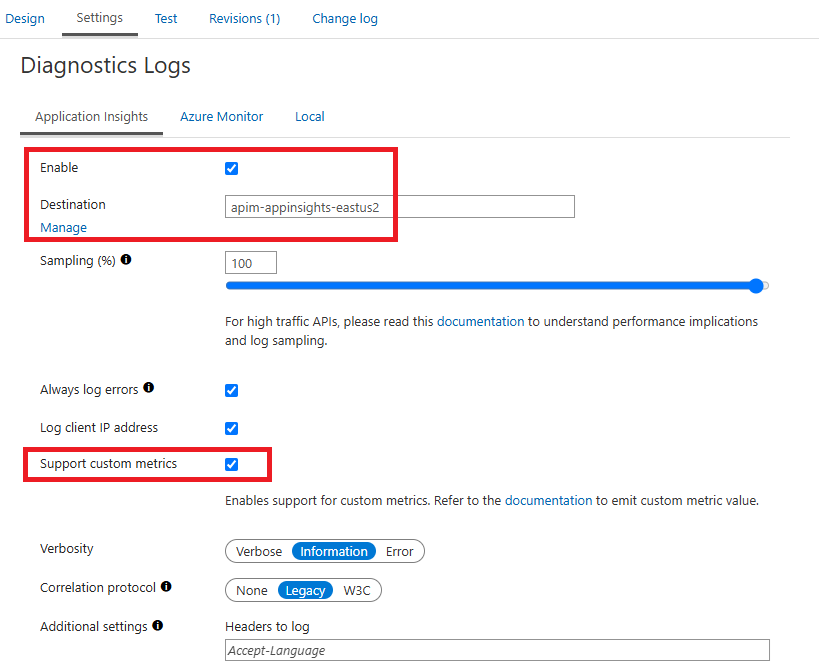
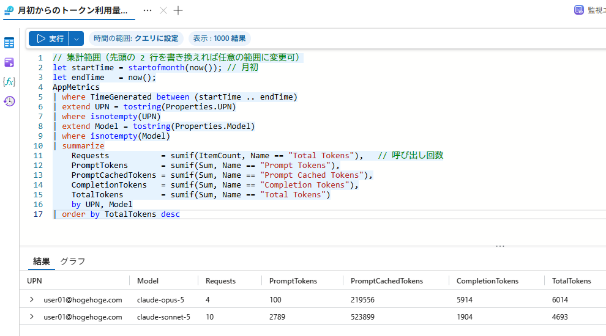

# カスタムメトリックによる LLM トークン使用量の監視

## Application Insights の有効化

[llm-emit-token-metric](https://learn.microsoft.com/ja-jp/azure/api-management/llm-emit-token-metric-policy) ポリシーによるロギングには、以下の画面設定にある Application Insights のカスタムメトリックの有効化が必要となります。



## APIM の inbound ポリシー

APIM の inbound ポリシーに、LLM Model 情報の抽出と UPN, Model を dimension とした llm-emit-token-metric のロギングを追加します。

> [!NOTE]
> [Microsoft Entra ID (旧 Azure AD) の JWT トークン](https://learn.microsoft.com/ja-jp/entra/identity-platform/access-token-claims-reference)で UPN は、現在よく使われるクレームは preferred_username ですが、以前は upn が同様の用途で使われることがありました。v1.0 トークンでは upn が含まれるケースが多く、v2.0 では preferred_username が推奨されています。

```xml
<inbound>
    <base />
    <!-- クライアント認証 -->
    <validate-azure-ad-token
        tenant-id="TENANT_ID"
        header-name="Authorization"
        failed-validation-httpcode="401"
        failed-validation-error-message="Unauthorized"
        output-token-variable-name="callerJwt">

        <client-application-ids>
            <application-id>CLI_APP_ID</application-id>
        </client-application-ids>

        <audiences>
            <audience>API_APP_ID</audience>
            <audience>api://API_APP_ID</audience>
        </audiences>

        <required-claims>
            <claim name="scp" match="all" separator=" ">
                <value>Claude.Invoke</value>
            </claim>
            <claim name="roles" match="any">
                <value>Claude.User</value>
            </claim>
        </required-claims>
    </validate-azure-ad-token>

    <!-- リクエスト本文の LLM Model を変数に退避 -->
    <set-variable name="modelName" value="@{
        try {
            var body = context.Request.Body?.As<JObject>(preserveContent: true);
            return body?["model"]?.ToString() ?? "unknown";
        } catch { return "unknown"; }
    }" />
    <!-- LLM カスタムメトリックのロギング -->
    <llm-emit-token-metric namespace="Anthropic">
        <dimension name="UPN" value="@(((Jwt)context.Variables["callerJwt"]).Claims.GetValueOrDefault("preferred_username"))" />
        <dimension name="Model" value="@((string)context.Variables["modelName"])" />
    </llm-emit-token-metric>

    ～ 以下省略 ～ 
</inbound>
```

## カスタムメトリックの集計

以下は Application Insights が接続している Log Analytics の AppMetrics テーブルを KQL でクエリした結果となります。

```kusto:LogAnalytics
// 集計範囲（先頭の 2 行を書き換えれば任意の範囲に変更可）
let startTime = startofmonth(now()); // 月初
let endTime   = now();
AppMetrics
| where TimeGenerated between (startTime .. endTime)
| extend UPN = tostring(Properties.UPN)
| where isnotempty(UPN)
| extend Model = tostring(Properties.Model)
| where isnotempty(Model)
| summarize
    Requests           = sumif(ItemCount, Name == "Total Tokens"),   // 呼び出し回数
    PromptTokens       = sumif(Sum, Name == "Prompt Tokens"),
    PromptCachedTokens = sumif(Sum, Name == "Prompt Cached Tokens"),
    CompletionTokens   = sumif(Sum, Name == "Completion Tokens"),
    TotalTokens        = sumif(Sum, Name == "Total Tokens")
    by UPN, Model
| order by TotalTokens desc
```



> [!NOTE]
> 以下は Application Insights のログで customMetrics テーブルを KQL でクエリ集計する例となります。得られる結果は同じですが、こちらは互換性の為に残されており、現在は上記の Log Analytics の AppMetrics テーブルを参照する方を推奨しています。

```kusto:ApplicationInsights
// 集計範囲（先頭の 2 行を書き換えれば任意の範囲に変更可）
let startTime = startofmonth(now()); // 月初
let endTime   = now();
customMetrics
| where timestamp between (startTime .. endTime)
| extend UPN = tostring(customDimensions.UPN)
| where isnotempty(UPN)
| extend Model = tostring(customDimensions.Model)
| where isnotempty(Model)
| summarize
    Requests           = sumif(valueCount, name == "Total Tokens"),   // 呼び出し回数
    PromptTokens       = sumif(valueSum, name == "Prompt Tokens"),
    PromptCachedTokens = sumif(valueSum, name == "Prompt Cached Tokens"),
    CompletionTokens   = sumif(valueSum, name == "Completion Tokens"),
    TotalTokens        = sumif(valueSum, name == "Total Tokens")
    by UPN, Model
| order by TotalTokens desc
```