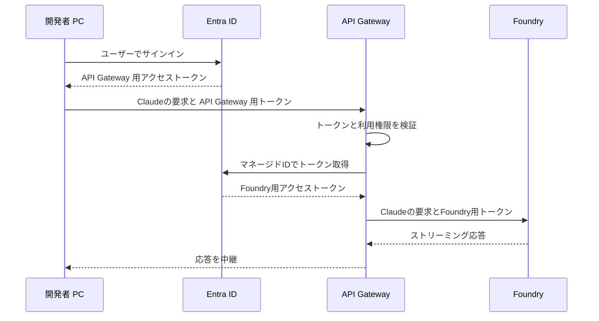

# Claude Code を Microsoft Foundry モデルで利用する

## はじめに

1. 開発者個人が Claude Code から直接 Microsoft Foundry モデルを利用したい場合は [Anthropic 社の公式ドキュメント](https://code.claude.com/docs/ja/microsoft-foundry) の手順で簡単に出来ます。
2. ここでは、法人としての利用を前提に `IT 基盤部が全社導入する` 際に必要となる認証やトレーサビリティの機能を [API Gateway](https://azure.microsoft.com/ja-jp/products/api-management) によって実現する方法を紹介します。

## 概要

本資料のシステム構成を導入する事で、社内のユーザーは、開発端末のコンソールで初回に一度だけ `az login` コマンドで Entra ID 認証をすれば、その後は `claude` コマンドを実行するだけで Claude Code が利用できるようになります。



## 構築手順

本資料では完全なデプロイ手順ではなく、Entra ID 構成の重要な部分を中心に記載しています。そのため Microsoft Foundry や Azure API Management のデプロイ手順や基本機能の説明などは省略しています。

> [!NOTE]
> 本資料は 2026-09-14 時点のポータル画面を元に作成されています。画面や選択肢は更新されることがあります。表記が画像と異なる場合は、同じ意味の最新の項目を選択してください。将来的には bicep による IaC コードの提供を予定しています。

### 1. Entra ID に API Gateway 認証用のアプリケーションを登録する

#### 1-1. Entra ID に認証用`アプリの登録`


| 設定項目 | 設定例 |
| --------------- | -------------- |
| 名前          | `claude-gateway-api` |
| サポートされているアカウントの種類 | `シングル テナントのみ` |
| リダイレクト URI (省略可能) | 省略します |

#### 1-2. 以下 2 つの ID 値を控えておきます。


| 表示名 | 値 |
| --------------- | -------------- |
| アプリケーション (クライアント) ID | `GUID` |
| ディレクトリ (テナント) ID | `GUID` |

#### 1-3. API の公開 - Scope の追加

参考資料：[Web API を公開するようにアプリケーションを構成する](https://learn.microsoft.com/entra/identity-platform/quickstart-configure-app-expose-web-apis)


| 設定項目 | 設定例 |
| --------------- | -------------- |
| スコープ名 | `Claude.Invoke` |
| 管理者の同意の表示名 | `API Gateway 経由で Claude モデルを利用する` |
| 管理者の同意の説明 | `サインインしたユーザーに代わって、API Gateway 経由で Microsoft Foundry 上の Claude モデルを呼び出すことをアプリケーションに許可します。` |

#### 1-4. API の公開 - クライアント アプリケーションの追加

Azure CLI を認証クライアントとして使うため、API の公開画面にある **「承認済みのクライアント アプリケーション」** で、Azure CLI のクライアント ID `04b07795-8ddb-461a-bbee-02f9e1bf7b46` と `Claude.Invoke` を事前承認します。


#### 1-5. アプリ ロールの作成

アプリロールとして `Claude.User` ロールを作成します。


| 設定項目 | 設定例 |
| --------------- | -------------- |
| 表示名 | `Claude.User` |
| 許可されたメンバーの種 | `ユーザーまたはグループ` |
| 値 | `Claude.User` |
| 説明 | `claude-gateway-api の利用を許可するユーザーまたはグループ` |

作成したアプリ ロール画面で `アプリ ロールを割り当てる方法` - `エンタープライズ アプリケーション` の順に画面遷移します。


`Claude.User` ロールに Entra ID のグループやユーザーを割り当てます。これらのグループやユーザーが API Gateway 経由で Foundry モデルを利用できます。


参考資料：[アプリ ロールを追加してトークンで受け取る](https://learn.microsoft.com/entra/identity-platform/howto-add-app-roles-in-apps)

### 2. API Gateway に Anthropic API をインポート

#### 2-1. [ポータルを使用して Microsoft Foundry API をインポートする](https://learn.microsoft.com/ja-jp/azure/api-management/azure-ai-foundry-api#import-microsoft-foundry-api-by-using-the-portal) の手順に従い、Anthropic API のインポートを実施します。

> [!NOTE]
> Microsoft Foundry 側で Claude モデルのデプロイが事前にされている事が前提です。本資料ではその部分は省略しています。

#### 2-2. API Gateway で開発者（エンドユーザー）の Entra ID 認証トークンを検証


**API Gateway で開発者（エンドユーザー）の Entra ID 認証トークンを検証**します。対象 API の `inbound` に、次のようなポリシーを設定します。

```xml
<inbound>
    <base />

    <!-- クライアント認証 -->
    <validate-azure-ad-token
        tenant-id="TENANT_ID"
        header-name="Authorization"
        failed-validation-httpcode="401"
        failed-validation-error-message="Unauthorized"
        output-token-variable-name="callerJwt">

        <client-application-ids>
            <application-id>CLI_APP_ID</application-id>
        </client-application-ids>

        <audiences>
            <audience>API_APP_ID</audience>
        </audiences>

        <required-claims>
            <claim name="scp" match="all" separator=" ">
                <value>Claude.Invoke</value>
            </claim>
            <claim name="roles" match="any">
                <value>Claude.User</value>
            </claim>
        </required-claims>
    </validate-azure-ad-token>

    <!-- Foundry モデルへのバックエンド認証 -->
    <set-backend-service id="apim-generated-policy" backend-id="foundry-fdpo-eastus2-ai-endpoint" />
</inbound>
```

クライアント認証処理で、`TENANT_ID`、`CLI_APP_ID`、`API_APP_ID` を実際の値に置き換えます。`TENANT_ID`、`API_APP_ID` は、手順 1-2 で控えていた ID 値を使用します。`CLI_APP_ID` は、Azure CLI のクライアント ID を示す以下の GUID を設定します。

| 設定項目 | 値 |
| --------------- | -------------- |
| TENANT_ID　| ディレクトリ (テナント) ID `GUID` |
| CLI_APP_ID | `04b07795-8ddb-461a-bbee-02f9e1bf7b46` |
| API_APP_ID　| アプリケーション (クライアント) ID `GUID` |

Foundry モデルへのバックエンド認証は、手順 2-1. Microsoft Foundry API をインポートする作業で自動的に設定されていますが、マニュアルで設定する場合は AI Gateway のシステム割り当てマネージド ID を有効化し、対象 Foundry リソースに `Foundry User` などの呼び出し権限を付与する必要があります。

参考資料：[API Gateway を使用して LLM API へのアクセスを認証および承認する](https://learn.microsoft.com/azure/api-management/api-management-authenticate-authorize-ai-apis#authenticate-with-managed-identity)

#### 2-3. 既定のキー（サブスクリプションキー）認証の削除

Entra ID 認証と既存のキー認証（サブスクリプションキー）を両方併用する事も可能ですが、ここでは、**Entra ID 認証だけで利用させる前提** で、対象 API の「Subscription required」を無効にします。[APIM のサブスクリプション設定](https://learn.microsoft.com/azure/api-management/api-management-subscriptions#enable-or-disable-subscription-requirement-for-api-or-product-access)


#### 2-4. AI Gateway による LLM トークン、ユーザー要求、応答のロギング

必要に応じて、[言語モデル API の要求または応答のログ記録を有効](https://learn.microsoft.com/ja-jp/azure/api-management/api-management-howto-llm-logs#enable-logging-of-requests-or-responses-for-language-model-api) にし、LLM トークン、ユーザー要求、応答をロギングします。これにより各ユーザーの利用状況などを集計・監査可能となります。

### 3. 開発者（エンドユーザー）の PC で Claude Code を設定

#### 3-1. Claude Code の設定

開発者（エンドユーザー）の PC で Claude Code のユーザー設定 `%USERPROFILE%\.claude\settings.json` で以下を追加します。

```json
{
  "apiKeyHelper": "az account get-access-token --tenant TENANT_ID --scope api://API_APP_ID/Claude.Invoke --query accessToken --output tsv --only-show-errors",
  "env": {
    "ANTHROPIC_BASE_URL": "https://<API Gateway>.azure-api.net/<API Name>anthropic",
    "ANTHROPIC_DEFAULT_SONNET_MODEL": "<Sonnet のデプロイ名>",
    "ANTHROPIC_DEFAULT_OPUS_MODEL": "<Opus のデプロイ名>",
    "CLAUDE_CODE_API_KEY_HELPER_TTL_MS": "240000"
  }
}
```

| 設定項目 | 値 |
| --------------- | -------------- |
| TENANT_ID　| ディレクトリ (テナント) ID `GUID` |
| API_APP_ID　| アプリケーション (クライアント) ID `GUID` |
| API Gateway | 以下の画像の URL 参照 |
| API Name | 以下の画像の URL 参照 |


この設定では [apiKeyHelper](https://code.claude.com/docs/en/llm-gateway-connect#rotate-credentials-with-apikeyhelper) のキャッシュ確認を 240 秒 = 4分に設定しています。これはアクセス トークンの有効期限が 5 分を切った時にリフレッシュ トークンでアクセス トークンを更新するという az コマンドの仕様から、常に 1 分の余裕を持たせる事でアクセス トークンの失効を防ぐための予防措置となります。

az account get-access-token が返すアクセス トークンは 60 ～ 90 分有効です。az コマンドはアクセス トークンの有効期限が 5 分以上ある場合、ローカルの MSAL キャッシュのアクセス トークンを返し、アクセス トークンの残り時間が 5 分を切った時だけ Entra ID へアクセスし、リフレッシュ トークンでアクセス トークンを取得します。そのため　Claude Code を実行中に実際に Entra ID へ通信が行くのは 60 ～ 90 に 1 回の頻度となります。

リフレッシュ トークンの有効期限は90日で、使用するたびに新しいトークンに置き換わります。このため日常的に Claude Code を使っている限り `az login` は初回の 1 回だけで、それ以降は翌日でも翌週でも、そのまま Claude Code を起動できます。90日間まったく Claude Code を使わなかった場合には、再度 `az login` を行う必要があります。

なお Entra ID テナントで MFA や条件付きアクセスによる一定期間の対話ログインやパスワード変更を要求している場合は、90日間を待たずに利用者はその間隔で再度 `az login` を行う必要があります。

#### 3-2. Claude Code の起動

`az login` は、初回に 1 回だけ必要です。ユーザーが複数のテナントに所属している場合は、`az login --tenant <TENANT_ID>` で該当のテナントを指定してログインしてください。

```powershell
az login
claude
```


### 4. トラブルシューティング

上手く動作しなかった場合、ステップ・バイ・ステップでトラブルシューティング手法を記載します。

#### 4-1. アクセス トークンの取得と確認

以下を PowerShell で実行し、アクセス トークンを取得・確認します。

| 設定項目 | 値 |
| --------------- | -------------- |
| TENANT_ID　| ディレクトリ (テナント) ID `GUID` |
| API_APP_ID　| アプリケーション (クライアント) ID `GUID` |
```powershell
$tenantId = "TENANT_ID"
$apiAppId = "API_APP_ID"
$scope = "api://$apiAppId/Claude.Invoke"

# 組織アカウントでサインイン
az login --tenant $tenantId --scope $scope --allow-no-subscriptions

# APIM用アクセストークンを取得
$token = az account get-access-token `
    --tenant $tenantId `
    --scope $scope `
    --query accessToken `
    --output tsv `
    --only-show-errors

echo $token
```

続けて以下を実行すると、$token のペイロード（roles などのクレーム）を JSON で表示できます。

```powershell
# Bearer が付いている場合は除去し、JWT を分割
$jwtParts = (([string]$token).Trim() -replace '^Bearer\s+', '').Split('.')

if ($jwtParts.Count -ne 3) {
    throw '$token に JWT 形式のアクセストークンを設定してください。'
}

# ペイロードの Base64URL を通常の Base64 に変換
$payloadBase64 = $jwtParts[1].Replace('-', '+').Replace('_', '/')
$payloadBase64 += '=' * ((4 - ($payloadBase64.Length % 4)) % 4)

# デコードして JSON を整形表示
$claims = [System.Text.Encoding]::UTF8.GetString(
    [System.Convert]::FromBase64String($payloadBase64)
) | ConvertFrom-Json

$claims | ConvertTo-Json -Depth 20
```

発行されたアクセストークンを JSON で表示し、以下の様な該当部分がある事を確認します。

```json
{
    "roles":  [
                  "Claude.User"
              ],
    "scp":  "Claude.Invoke",
}
```

#### 4-2. API Gateway ポータルでのテスト機能による検証


#### 4-3. Claude Code 検証用の環境設定


```powershell
$tenantId = "TENANT_ID"
$apiAppId = "API_APP_ID"
$scope = "api://$apiAppId/Claude.Invoke"

# 組織アカウントでサインイン
az login --tenant $tenantId --scope $scope --allow-no-subscriptions

# APIM用アクセストークンを取得
$token = az account get-access-token `
    --tenant $tenantId `
    --scope $scope `
    --query accessToken `
    --output tsv `
    --only-show-errors

if ($LASTEXITCODE -ne 0 -or [string]::IsNullOrWhiteSpace($token)) {
    throw "アクセストークンを取得できませんでした。"
}

# APIM経由でFoundryを利用
$env:CLAUDE_CODE_USE_FOUNDRY = "1"
$env:ANTHROPIC_FOUNDRY_RESOURCE = $null
$env:ANTHROPIC_FOUNDRY_API_KEY = $null
$env:ANTHROPIC_FOUNDRY_BASE_URL = "https://<API Gateway>.azure-api.net/<API Name>anthropic"
$env:ANTHROPIC_FOUNDRY_AUTH_TOKEN = $token.Trim()

$env:ANTHROPIC_DEFAULT_SONNET_MODEL = "<Sonnetのデプロイ名>"
$env:ANTHROPIC_DEFAULT_OPUS_MODEL = "<Opusのデプロイ名>"

claude
```