# Claude Code から Microsoft Foundry の Claude モデルを利用する

## はじめに

開発者個人が Claude Code から Microsoft Foundry の Claude モデルを直接利用する場合は、[Anthropic の公式ドキュメント](https://code.claude.com/docs/ja/microsoft-foundry) を参照してください。

本資料は、**IT 基盤部門による組織への導入**を想定しています。[Azure API Management](https://azure.microsoft.com/ja-jp/products/api-management)（以下、APIM）を AI Gateway として利用し、ユーザー認証と利用権限の制御を行う構成、および利用状況を監査する際の注意点を紹介します。

## 目次

- [概要](#概要)
- [前提条件](#前提条件)
- [1. Microsoft Entra ID の設定](#1-microsoft-entra-id-の設定)
- [2. API Management の設定](#2-api-management-の設定)
- [3. 開発者 PC の設定](#3-開発者-pc-の設定)
- [4. トラブルシューティング](#4-トラブルシューティング)

## 概要

この構成では、ユーザーが開発端末で `az login` により Microsoft Entra ID にサインインすると、Claude Code が Azure CLI 経由で APIM 用のアクセス トークンを取得します。サインイン状態が有効な間は、通常、`claude` コマンドだけで利用を再開できます。条件付きアクセスやセッションの失効などにより、再サインインが必要になる場合があります。

APIM はユーザーのトークンと利用権限を検証した後、**APIM 自身のマネージド ID** で Foundry にアクセスします。ユーザーのトークンをそのまま Foundry に転送する構成ではありません。

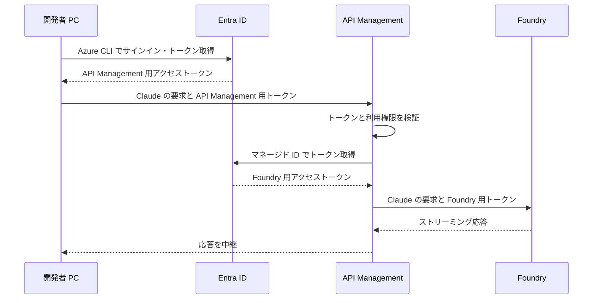

## 前提条件

本資料は Entra ID と APIM の認証設定を中心に説明します。Foundry や APIM 自体のデプロイ手順、ネットワーク構成の詳細は対象外です。

- **Azure リソース**: APIM と、利用する Claude モデルをデプロイ済みの Foundry リソース。
- **管理者権限**: アプリ登録、スコープの事前承認、ユーザー・グループへのアプリ ロール割り当て、および Foundry リソースへの Azure RBAC ロール割り当てに必要な権限。
- **開発端末**: Azure CLI と Claude Code をインストール済みの Windows PC。本資料のコマンド例は PowerShell 用です。
- **接続性**: 開発端末から Entra ID・APIM へ、APIM から Foundry へ接続できること。
- **ログ基盤（任意）**: ログを収集する場合は、Log Analytics ワークスペースと診断設定を変更する権限。

利用者は認証用アプリの `Claude.User` ロールに割り当てます。Foundry を呼び出す Azure RBAC 権限は APIM のマネージド ID に付与するため、この経路の利用だけであれば、利用者個人に Foundry リソースの権限を付与する必要はありません。

> [!NOTE]
> 画像は 2026-09-14 時点のポータル画面を基にしています。画面や選択肢は更新されるため、現在の表示と公式ドキュメントを確認してください。

## 1. Microsoft Entra ID の設定

### 1.1. 認証用アプリを登録する

Microsoft Entra ID の **アプリの登録** から、APIM にアクセスするための API を登録します。

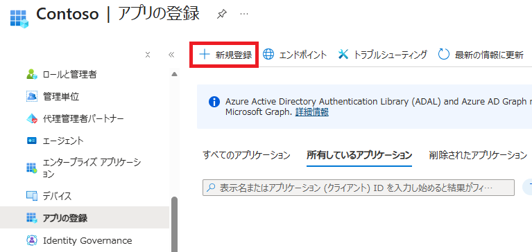

| 設定項目 | 設定例 |
| --- | --- |
| 名前 | `claude-gateway-api` |
| サポートされているアカウントの種類 | シングル テナント |
| リダイレクト URI（省略可能） | 設定不要 |

### 1.2. アプリとテナントの ID を控える

後続の設定例では、次のプレースホルダーを実際の GUID に置き換えます。

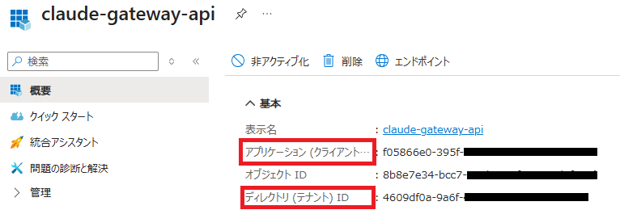

| ポータルの表示名 | 本資料のプレースホルダー |
| --- | --- |
| アプリケーション (クライアント) ID | `API_APP_ID` |
| ディレクトリ (テナント) ID | `TENANT_ID` |

### 1.3. API を公開し、スコープを追加する

**API の公開** で、アプリケーション ID URI を `api://API_APP_ID` に設定します。続いて、委任されたアクセス許可を表すスコープ `Claude.Invoke` を追加します。完全なスコープ名は `api://API_APP_ID/Claude.Invoke` です。

参考資料：[Web API を公開するようにアプリケーションを構成する](https://learn.microsoft.com/entra/identity-platform/quickstart-configure-app-expose-web-apis)

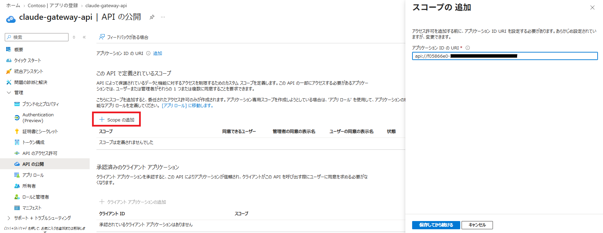

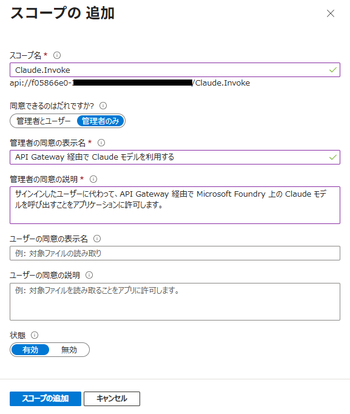

| 設定項目 | 設定例 |
| --- | --- |
| スコープ名 | `Claude.Invoke` |
| 同意できるユーザー | 管理者のみ |
| 管理者の同意の表示名 | `API Management 経由で Claude モデルを利用する` |
| 管理者の同意の説明 | `サインインしたユーザーに代わって、API Management 経由で Microsoft Foundry 上の Claude モデルを呼び出すことをアプリケーションに許可します。` |
| 状態 | 有効 |

### 1.4. Azure CLI をクライアントとして事前承認する

Azure CLI を認証クライアントとして使うため、API の公開画面にある **「承認済みのクライアント アプリケーション」** で、Azure CLI のクライアント ID `04b07795-8ddb-461a-bbee-02f9e1bf7b46` と `Claude.Invoke` を事前承認します。

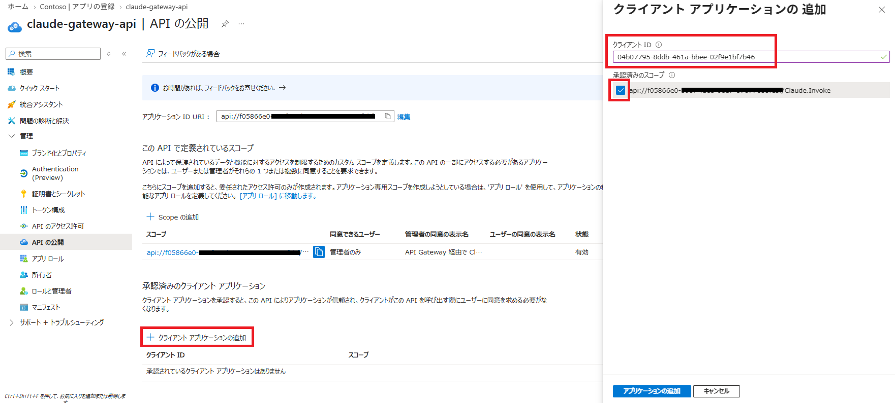

事前承認は Azure CLI によるスコープ利用への同意であり、すべてのユーザーにゲートウェイの利用権限を付与するものではありません。利用者の制限は、次のアプリ ロールと APIM ポリシーで行います。

### 1.5. アプリ ロールを作成し、利用者に割り当てる

アプリ ロール `Claude.User` を作成します。

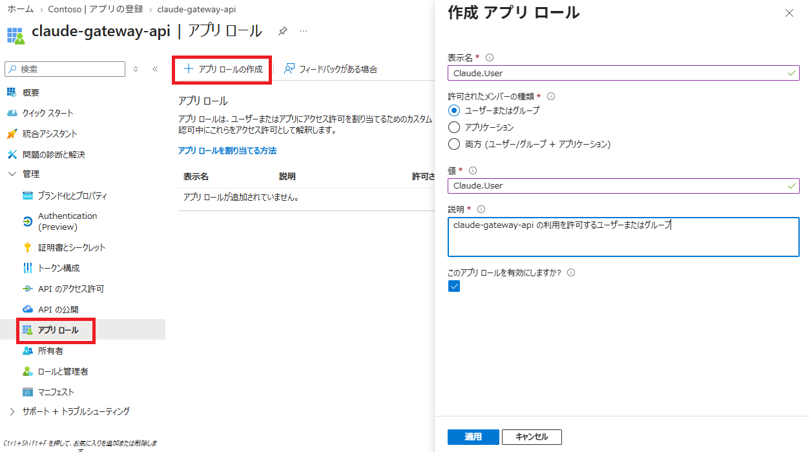

| 設定項目 | 設定例 |
| --- | --- |
| 表示名 | `Claude.User` |
| 許可されたメンバーの種類 | ユーザーまたはグループ |
| 値 | `Claude.User` |
| 説明 | `claude-gateway-api の利用を許可するユーザーまたはグループ` |

作成したアプリ ロールの画面で、**アプリ ロールを割り当てる方法**、**エンタープライズ アプリケーション** の順に進みます。

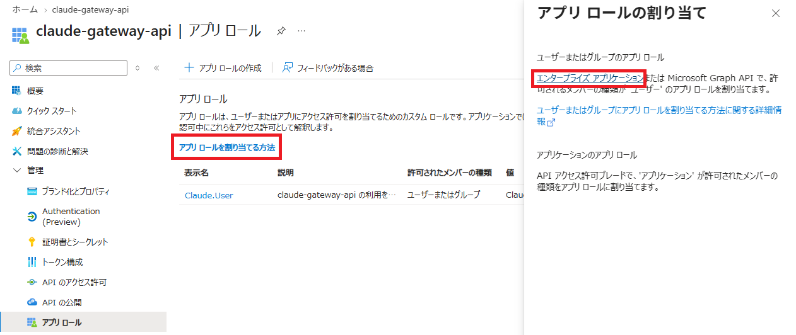

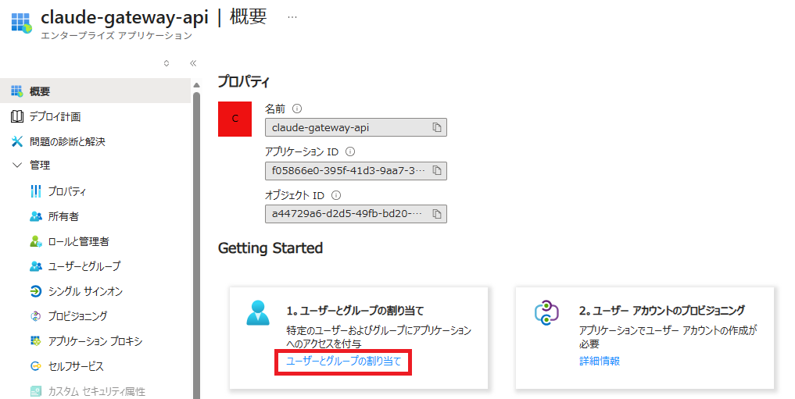

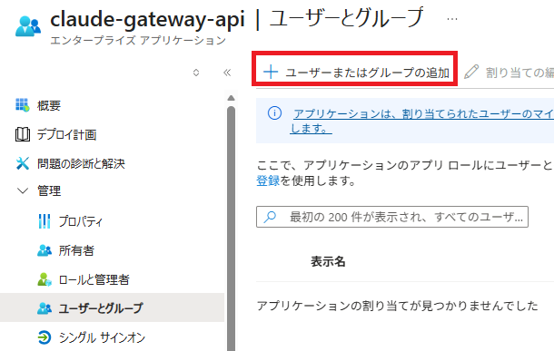

**ユーザーとグループ** で対象のユーザーまたはグループを追加し、`Claude.User` ロールを選択します。後続の APIM ポリシーは、アクセス トークンの `scp` に `Claude.Invoke`、`roles` に `Claude.User` が含まれることを検証します。

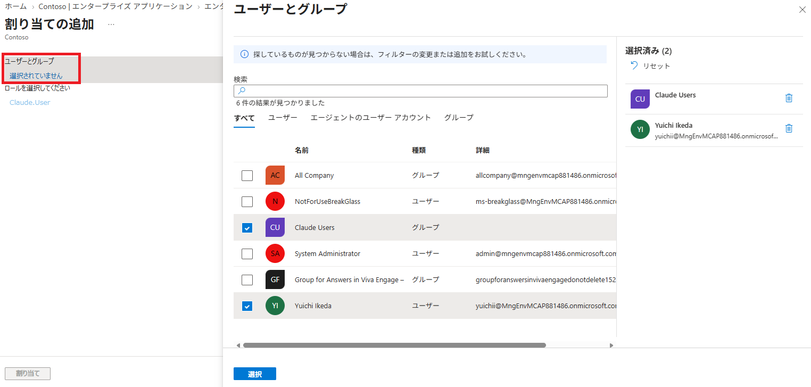

> [!NOTE]
> グループ単位の割り当てには Microsoft Entra ID P1 または P2 が必要です。入れ子のグループのメンバーには割り当てが継承されません。詳細は [ユーザーとグループのアプリへの割り当て](https://learn.microsoft.com/entra/identity/enterprise-apps/assign-user-or-group-access-portal) を参照してください。

参考資料：[アプリ ロールを追加してトークンで受け取る](https://learn.microsoft.com/entra/identity-platform/howto-add-app-roles-in-apps)

## 2. API Management の設定

### 2.1. Anthropic 互換 API をインポートする

[Microsoft Foundry API のインポート手順](https://learn.microsoft.com/ja-jp/azure/api-management/azure-ai-foundry-api#import-microsoft-foundry-api-by-using-the-portal) を参考に、対象の Foundry リソースを選択します。

Claude Code が使うのは **Anthropic Messages API** です。インポート後に、少なくとも `POST /anthropic/v1/messages` と `POST /anthropic/v1/messages/count_tokens` が対象の Foundry エンドポイントに転送されることを確認してください。`/chat/completions` のみの API では代用できません。

> [!NOTE]
> インポート画面で提供される API の種類は更新されます。参照先は Foundry API 全般の手順であり、Anthropic の操作が自動作成されることを保証するものではありません。不足する場合は、[Claude の API 仕様](https://learn.microsoft.com/azure/foundry/foundry-models/concepts/claude-models#api-overview) に従って操作とバックエンドへのルーティングを追加してください。

ストリーミング応答を利用するため、対象 API の **All operations** からポリシー エディターを開き、`backend` セクションで適用される `forward-request` に `buffer-response="false"` を設定します。`base` で上位スコープから継承している場合は、継承元を含む有効なポリシーを確認してください。既定値は `true` です。詳細は [forward-request ポリシー](https://learn.microsoft.com/azure/api-management/forward-request-policy) を参照してください。

操作単位のポリシーがある場合は、API 全体の認証ポリシーを継承する `inbound` の `base` を削除しないでください。

### 2.2. ユーザーのアクセス トークンを検証する

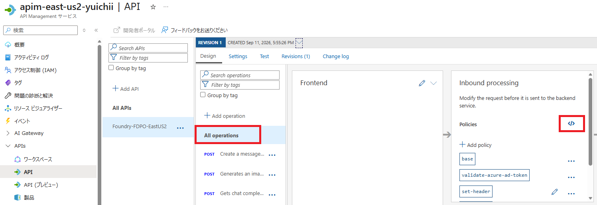

対象 API の **All operations** にある `inbound` で、開発者の Entra ID アクセス トークンを検証します。以下は `inbound` 部分の例です。インポート時に生成されたバックエンド設定や、既存の `backend`・`outbound`・`on-error` は保持してください。

```xml
<inbound>
    <base />

    <!-- クライアント認証 -->
    <validate-azure-ad-token
        tenant-id="TENANT_ID"
        header-name="Authorization"
        failed-validation-httpcode="401"
        failed-validation-error-message="Unauthorized"
        output-token-variable-name="callerJwt">

        <client-application-ids>
            <application-id>CLI_APP_ID</application-id>
        </client-application-ids>

        <audiences>
            <audience>API_APP_ID</audience>
            <audience>api://API_APP_ID</audience>
        </audiences>

        <required-claims>
            <claim name="scp" match="all" separator=" ">
                <value>Claude.Invoke</value>
            </claim>
            <claim name="roles" match="any">
                <value>Claude.User</value>
            </claim>
        </required-claims>
    </validate-azure-ad-token>

    <set-header name="x-api-key" exists-action="delete" />
    <set-header name="api-key" exists-action="delete" />

    <!-- インポート時に作成されたバックエンドを指定 -->
    <set-backend-service id="apim-generated-policy" backend-id="FOUNDRY_BACKEND_ID" />
</inbound>
```

`TENANT_ID`、`CLI_APP_ID`、`API_APP_ID`、`FOUNDRY_BACKEND_ID` を以下の値に置き換えます。2 か所ある `API_APP_ID` には同じ GUID を設定してください。

| 設定項目 | 値 |
| --------------- | -------------- |
| `TENANT_ID` | ディレクトリ (テナント) ID |
| `CLI_APP_ID` | Azure CLI のクライアント ID: `04b07795-8ddb-461a-bbee-02f9e1bf7b46` |
| `API_APP_ID` | 認証用アプリのアプリケーション (クライアント) ID |
| `FOUNDRY_BACKEND_ID` | API インポート時に生成された `set-backend-service` の `backend-id` |

`aud` はトークンの宛先です。v2.0 トークンでは API のクライアント ID、v1.0 トークンではクライアント ID またはアプリケーション ID URI になります。この例は、同じ認証用アプリを表す `API_APP_ID` と `api://API_APP_ID` の両方を許可します。独自のアプリケーション ID URI を使用する場合は、後者をその URI に変更してください。詳細は [アクセス トークンのクレーム](https://learn.microsoft.com/entra/identity-platform/access-token-claims-reference) を参照してください。

`apiKeyHelper` は取得した値を `Authorization` と `x-api-key` の両方に設定します。クライアント認証後にキー用ヘッダーを削除し、APIM から Foundry への認証情報と混在しないようにします。

> [!IMPORTANT]
> `set-backend-service` は転送先を選択するポリシーであり、それだけでマネージド ID 認証を設定するものではありません。選択したバックエンドにマネージド ID 認証が設定され、ユーザーの `Authorization` が Foundry 用のトークンに置き換わることを確認してください。

インポート時に生成された認証設定を確認します。手動で設定する場合は、APIM のシステム割り当てマネージド ID を有効にし、対象の **Foundry リソースのスコープ** で `Foundry User`（旧称 `Azure AI User`）などのモデル呼び出し権限を付与します。`Cognitive Services User` でも呼び出せます。

Claude の Entra ID 認証で要求するスコープは `https://ai.azure.com/.default` です。バックエンド認証をポリシーで設定する場合は、ユーザーのトークン検証とキー用ヘッダーの削除より後の `inbound` に、次を追加します。生成済みの認証設定がある場合は重複させず、トークンの宛先を確認してください。

```xml
<authentication-managed-identity resource="https://ai.azure.com" />
```

このポリシーは `Authorization` をマネージド ID の Bearer トークンに置き換えます。ユーザー認証用の `api://API_APP_ID/Claude.Invoke` と、Foundry 呼び出し用のスコープを混同しないでください。

参考資料：[Claude の Entra ID 認証](https://learn.microsoft.com/azure/foundry/foundry-models/how-to/use-foundry-models-claude#call-the-claude-messages-api)、[Claude Code の Azure RBAC](https://learn.microsoft.com/azure/foundry/foundry-models/how-to/configure-claude-code#configure-azure-rbac)、[マネージド ID 認証ポリシー](https://learn.microsoft.com/azure/api-management/authentication-managed-identity-policy)

### 2.3. サブスクリプション キーを不要にする

Entra ID 認証と APIM のサブスクリプション キーは併用できますが、本資料では **Entra ID 認証のみ** を使うため、対象 API の **Subscription required** を無効にします。これはキー自体を削除する操作ではなく、対象 API でキーを必須にしない設定です。

認証ポリシーをすべての対象操作に適用してから変更し、トークンを付けない要求が拒否されることを確認してください。

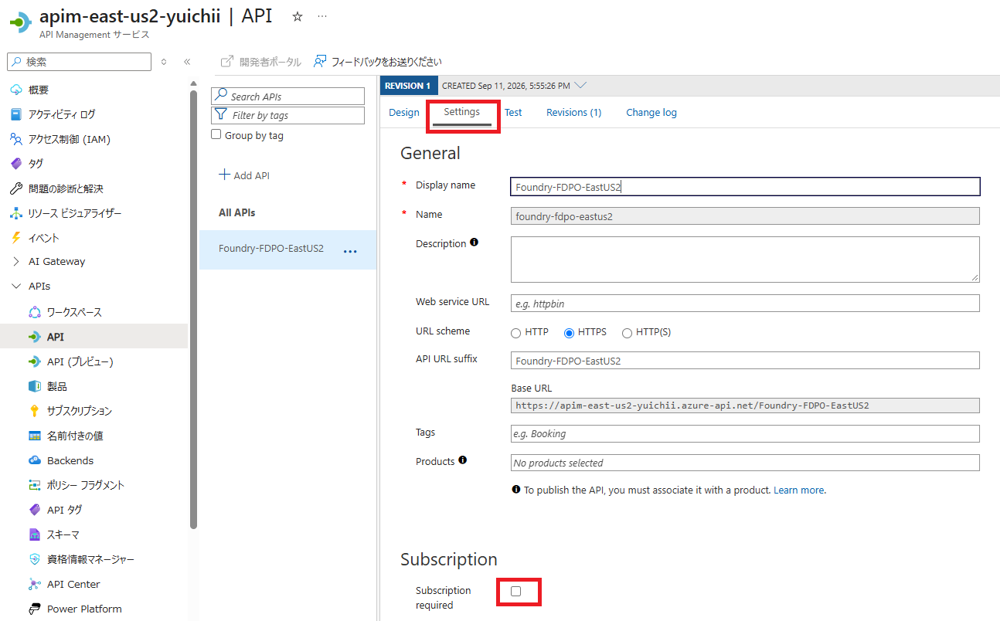

参考資料：[APIM のサブスクリプション設定](https://learn.microsoft.com/azure/api-management/api-management-subscriptions#enable-or-disable-subscription-requirement-for-api-or-product-access)

### 2.4. 利用状況のログを設定する

[言語モデル API のログ記録](https://learn.microsoft.com/ja-jp/azure/api-management/api-management-howto-llm-logs) を参考に、必要に応じて次を設定します。

1. APIM の診断設定で、AI Gateway のログを Log Analytics ワークスペースへ送信します。
2. 対象 API の診断設定で、必要な範囲のプロンプト・応答の記録を有効にします。
3. 利用者別の監査が必要な場合は、検証済みの `callerJwt` から取得した `tid` と `oid` を要求 ID と関連付けて APIM 側に記録する処理を追加します。

**LLM ログを有効にするだけでは、Entra ID ユーザー別の集計は完成しません。** Foundry が認識する呼び出し元は APIM のマネージド ID です。この README の認証ポリシーには、ユーザー ID をログへ記録する処理は含まれていません。未検証のクライアント指定ヘッダーを利用者の識別根拠にしないでください。

利用するゲートウェイで Anthropic Messages API のトークン使用量やストリーミング応答が期待どおり記録されるか、実際のログで確認してください。公式の LLM ログ手順はチャット補完 API を前提としており、すべての Claude API 操作の記録を保証するものではありません。ストリームの中断やログのサイズ上限により、記録が欠ける場合もあります。

> [!WARNING]
> プロンプトや応答にはソースコード・機密情報・個人情報が含まれる可能性があります。保存対象、保持期間、閲覧権限、マスキング方針を事前に定めてください。`Authorization` やキー用ヘッダーに含まれる認証情報はログへ記録しないでください。

## 3. 開発者 PC の設定

### 3.1. Claude Code のユーザー設定を追加する

本資料では、Claude Code の **汎用 LLM Gateway 接続**と `apiKeyHelper` を使用します。Foundry への直接接続モードとは異なるため、`CLAUDE_CODE_USE_FOUNDRY` や `ANTHROPIC_FOUNDRY_*` は設定しません。既存のプロバイダー設定や、固定値の `ANTHROPIC_AUTH_TOKEN`・`ANTHROPIC_API_KEY` が残っていないことを確認してください。

ユーザー設定 `%USERPROFILE%\.claude\settings.json` に次の項目を追加します。既存の設定がある場合は、ファイル全体を上書きせず、各項目を統合してください。

```json
{
    "model": "sonnet",
    "apiKeyHelper": "az account get-access-token --tenant TENANT_ID --scope api://API_APP_ID/Claude.Invoke --query accessToken --output tsv --only-show-errors",
    "env": {
        "ANTHROPIC_BASE_URL": "https://<APIM_NAME>.azure-api.net/<API_URL_SUFFIX>/anthropic",
        "ANTHROPIC_DEFAULT_SONNET_MODEL": "<Sonnet のデプロイ名>",
        "ANTHROPIC_DEFAULT_OPUS_MODEL": "<Opus のデプロイ名>",
        "ANTHROPIC_DEFAULT_HAIKU_MODEL": "<小規模タスク用のデプロイ名>",
        "CLAUDE_CODE_API_KEY_HELPER_TTL_MS": "240000"
    }
}
```

| 設定項目 | 値 |
| --- | --- |
| `TENANT_ID` | 手順 1.2 で控えたディレクトリ (テナント) ID |
| `API_APP_ID` | 手順 1.2 で控えたアプリケーション (クライアント) ID |
| `APIM_NAME` | APIM のサービス名。独自ドメインの場合はホスト名全体を変更 |
| `API_URL_SUFFIX` | 対象 API の **API URL suffix**。API の `Name` や表示名ではありません |
| 各モデルのデプロイ名 | Foundry に実在するデプロイ名。モデルの表示名ではありません |

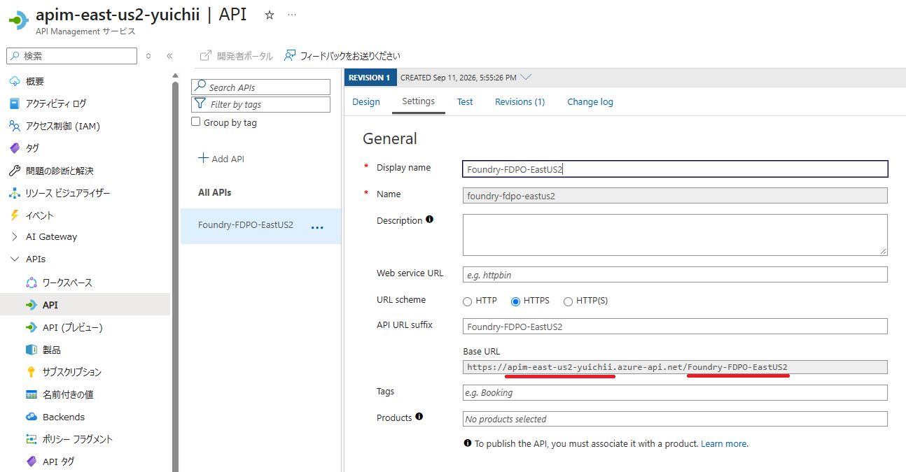

画像の **Base URL** を基に、手順 2.1 の操作パスに合わせて `ANTHROPIC_BASE_URL` を設定します。この例では末尾に `/anthropic` を付け、Claude Code がその後ろに `/v1/messages` などを追加します。操作パスを変更した場合はそれに合わせて調整し、`/anthropic` や `/v1/messages` を重複させないでください。

小規模なバックグラウンド処理でも利用可能なモデルを指定してください。Haiku をデプロイしていない場合は、`ANTHROPIC_DEFAULT_HAIKU_MODEL` に利用可能な Sonnet のデプロイ名などを設定できますが、そのモデルの料金と性能が適用されます。Opus を利用する場合も、対応するデプロイが必要です。

### 3.2. トークンのキャッシュと再サインイン

`CLAUDE_CODE_API_KEY_HELPER_TTL_MS` は、[apiKeyHelper の出力をキャッシュする期間](https://code.claude.com/docs/en/llm-gateway-connect#rotate-credentials-with-apikeyhelper) です。この例の `240000` ミリ秒は **240 秒（4 分）** に相当し、キャッシュの期限が切れた後、必要に応じてヘルパーを再実行します。

[Azure CLI のコマンド リファレンス](https://learn.microsoft.com/cli/azure/account#az-account-get-access-token) では、取得したトークンは少なくとも 5 分間有効と説明されています。ここではヘルパーのキャッシュ期間を 4 分に抑えて余裕を持たせていますが、トークンの失効や再認証要求を防ぐ保証ではありません。

Azure CLI は有効なキャッシュを再利用し、必要に応じてトークンを更新します。ヘルパーを実行するたびに Entra ID へ通信するわけではなく、返されたトークンの残り有効期間や実際の通信間隔も一定ではありません。

リフレッシュ トークンの既定の有効期間は多くのシナリオで 90 日ですが、条件付きアクセスのサインイン頻度、管理者によるセッションの失効などで、それより前に再サインインが必要になる場合があります。詳細は [リフレッシュ トークンの有効期間と失効](https://learn.microsoft.com/entra/identity-platform/refresh-tokens) を参照してください。

### 3.3. サインインして Claude Code を起動する

初回、または再認証が必要になったときに、設定した API のテナントとスコープを指定してサインインします。`--allow-no-subscriptions` は、Azure サブスクリプションへの権限がない利用者もサインインできるようにする指定です。アプリ ロールの割り当ては別途必要です。

```powershell
az login --tenant TENANT_ID --scope api://API_APP_ID/Claude.Invoke --allow-no-subscriptions
```

サインインに成功したら、作業対象のディレクトリで起動します。次回以降、サインイン状態が有効であれば、このコマンドだけで利用できます。

```powershell
claude
```

Claude Code の `/status` で APIM のベース URL と認証情報の取得元を確認し、短いプロンプトを送信して応答を確認してください。

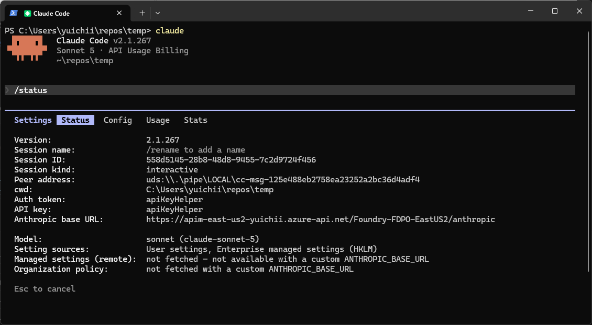

## 4. トラブルシューティング

**トークン取得、APIM への要求、Claude Code の設定** の順に確認すると、問題を切り分けやすくなります。以下の PowerShell 例は、同じターミナル セッションで順に実行してください。

### 4.1. アクセス トークンを取得し、クレームを確認する

アプリのスコープやロールを変更しても、発行済みのトークンの内容は変わりません。変更後のトークンを取得するには、必要に応じて `az logout` と `az login` でサインインし直します。設定の反映には時間がかかる場合があります。

> [!NOTE]
> `az account clear` はサブスクリプション情報のキャッシュを削除するコマンドで、サインアウトの代わりではありません。以下の `az logout` は現在の Azure CLI のサインイン状態に影響するため、通常の起動時には実行せず、認証をやり直す必要があるときだけ使用してください。

`TENANT_ID` と `API_APP_ID` を手順 1.2 の値に置き換えて実行します。

```powershell
$tenantId = "TENANT_ID"
$apiAppId = "API_APP_ID"
$scope = "api://$apiAppId/Claude.Invoke"

az logout

az login --tenant $tenantId --scope $scope --allow-no-subscriptions
if ($LASTEXITCODE -ne 0) {
        throw "Azure CLI へのサインインに失敗しました。"
}

$token = az account get-access-token `
    --tenant $tenantId `
    --scope $scope `
    --query accessToken `
    --output tsv `
    --only-show-errors

if ($LASTEXITCODE -ne 0 -or [string]::IsNullOrWhiteSpace($token)) {
    throw "アクセス トークンを取得できませんでした。"
}
```

続けて、`$token` のペイロードを端末内でデコードし、認証に関係するクレームを確認します。**デコードは署名検証ではありません。** トークンの署名・有効期限などの検証は APIM が行います。

```powershell
# Bearer が付いている場合は除去し、JWT を分割
$jwtParts = (([string]$token).Trim() -replace '^Bearer\s+', '').Split('.')

if ($jwtParts.Count -ne 3) {
    throw '$token に JWT 形式のアクセス トークンを設定してください。'
}

# ペイロードの Base64URL を通常の Base64 に変換
$payloadBase64 = $jwtParts[1].Replace('-', '+').Replace('_', '/')
$payloadBase64 += '=' * ((4 - ($payloadBase64.Length % 4)) % 4)

# デコードして JSON を整形表示
$claims = [System.Text.Encoding]::UTF8.GetString(
    [System.Convert]::FromBase64String($payloadBase64)
) | ConvertFrom-Json

$claims | Select-Object ver, aud, tid, azp, appid, scp, roles, exp | ConvertTo-Json -Depth 20
```

以下の内容が含まれることを確認します。`aud` は `API_APP_ID` または設定済みのアプリケーション ID URI、`scp` は `Claude.Invoke` を含む文字列です。

```json
{
    "aud": "API_APP_ID",
    "tid": "TENANT_ID",
    "roles": ["Claude.User"],
    "scp": "Claude.Invoke"
}
```

さらに、`azp`（v2.0）または `appid`（v1.0）が Azure CLI のクライアント ID であり、`exp` が示す有効期限を過ぎていないことを確認してください。

> [!WARNING]
> アクセス トークンは有効期間内に API を呼び出せる認証情報です。チャット、Issue、公開ログなどへ貼り付けたり、リポジトリへ保存したりしないでください。クレームにも個人情報が含まれる場合があります。

### 4.2. APIM ポータルのテスト機能で確認する

APIM ポータルで対象 API の **Test** を開き、Anthropic Messages API の `POST /anthropic/v1/messages` を選択します。Claude Code を介さずに呼び出し、APIM・Foundry 側の問題か、Claude Code 側の設定の問題かを切り分けます。

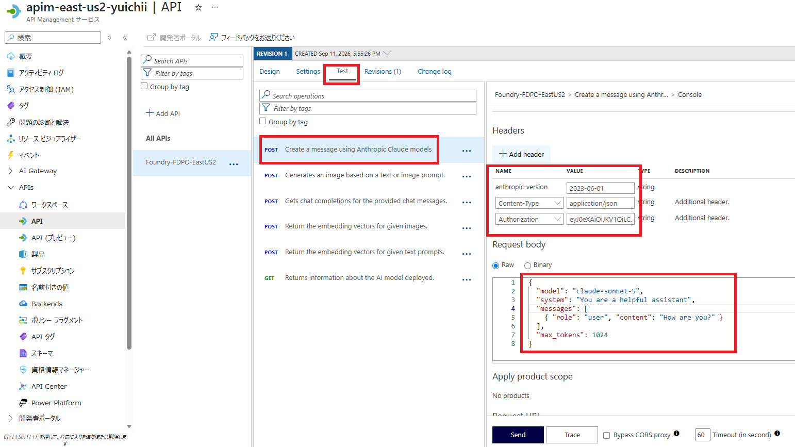

画像は操作場所を示す参考です。`Authorization` の形式とモデルのデプロイ名は、以下の説明に従って入力してください。

| HTTP ヘッダー | 値 |
| --- | --- |
| `anthropic-version` | `2023-06-01` |
| `Content-Type` | `application/json` |
| `Authorization` | `Bearer <取得したアクセス トークン>` |

`Authorization` には `Bearer` と半角スペースを付けます。ポータルは `$token` という文字列を PowerShell の変数として解釈しません。次のコマンドでヘッダー値をクリップボードにコピーできます。検証後はクリップボードと必要に応じてその履歴を消去してください。

```powershell
"Bearer $($token.Trim())" | Set-Clipboard
```

**Request body** の `model` を実在するデプロイ名に置き換えます。

```json
{
    "model": "<Sonnet のデプロイ名>",
    "system": "You are a helpful assistant",
    "messages": [
        { "role": "user", "content": "How are you?" }
    ],
    "max_tokens": 1024
}
```

ポータルのテスト機能が `Ocp-Apim-Subscription-Key` を自動追加する場合があります。キー不要の設定を検証するときは、そのヘッダーを付けずに成功することも確認してください。

### 4.3. 一時的な環境変数で Claude Code を検証する

ユーザー設定をまだ追加していない検証環境では、手順 4.1 で取得した `$token` と環境変数だけで試せます。ここでも手順 3 と同じ汎用 LLM Gateway 接続を使います。既存のユーザー・プロジェクト・管理設定が同じ環境変数を指定している場合は、そちらが優先されることがあるため、設定の競合を確認してください。

```powershell
if ([string]::IsNullOrWhiteSpace($token)) {
    throw "先に手順 4.1 でアクセス トークンを取得してください。"
}

$env:CLAUDE_CODE_USE_FOUNDRY = $null
$env:CLAUDE_CODE_USE_BEDROCK = $null
$env:CLAUDE_CODE_USE_VERTEX = $null
$env:ANTHROPIC_API_KEY = $null
$env:ANTHROPIC_BASE_URL = "https://<APIM_NAME>.azure-api.net/<API_URL_SUFFIX>/anthropic"
$env:ANTHROPIC_AUTH_TOKEN = $token.Trim()

$env:ANTHROPIC_DEFAULT_SONNET_MODEL = "<Sonnet のデプロイ名>"
$env:ANTHROPIC_DEFAULT_OPUS_MODEL = "<Opus のデプロイ名>"
$env:ANTHROPIC_DEFAULT_HAIKU_MODEL = "<小規模タスク用のデプロイ名>"

claude --model sonnet
```

この方法はトークンの固定値を渡すため、**有効期限が切れても自動更新されません**。長時間の利用には手順 3 の `apiKeyHelper` を使い、検証終了後はこの PowerShell セッションを閉じて一時設定を解除してください。

### 4.4. エラー別の確認箇所

| 症状 | 主な確認箇所 |
| --- | --- |
| トークンを取得できない | サインイン先テナント、アプリケーション ID URI、スコープの事前承認、条件付きアクセス |
| APIM の検証で `401` | `Authorization`、`aud`、`scp`、`roles`、クライアント ID、有効期限。このポリシー例ではロール不足も `401` |
| Foundry から `401` / `403` | APIM のマネージド ID、Foundry リソースへの RBAC 割り当て、トークンの宛先、ネットワーク制限 |
| `404` | API URL suffix、`/anthropic` を含む操作パス、Foundry のデプロイ名 |
| 応答が最後まで表示されない | ストリーミング応答のバッファリング、タイムアウト、途中のプロキシ |
| 未対応フィールドを示す `400` | Claude Code と Foundry の API 機能の差異。[Gateway のエラー対処](https://code.claude.com/docs/en/llm-gateway-connect#troubleshoot-gateway-errors) を参照 |

APIM のトレースを確認する場合も、ユーザーやマネージド ID のアクセス トークン、プロンプト内の機密情報を共有しないでください。