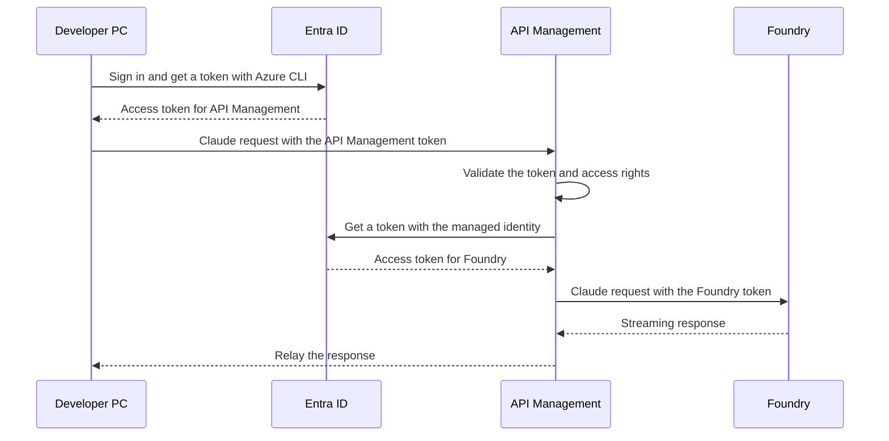

# Using Claude models on Microsoft Foundry from Claude Code

## Introduction

If an individual developer wants to use Claude models on Microsoft Foundry directly from Claude Code, refer to the [official Microsoft documentation](https://learn.microsoft.com/azure/foundry/foundry-models/how-to/configure-claude-code).

This document assumes **rollout to an organization by an IT platform team**. It describes a configuration that uses [Azure API Management](https://azure.microsoft.com/products/api-management) (hereafter APIM) as an AI Gateway to handle user authentication and access control, along with points to be aware of when auditing usage.

## Table of contents

- [Overview](#overview)
- [Prerequisites](#prerequisites)
- [1. Configure Microsoft Entra ID](#1-configure-microsoft-entra-id)
- [2. Configure API Management](#2-configure-api-management)
- [3. Configure the developer PC](#3-configure-the-developer-pc)
- [4. Troubleshooting](#4-troubleshooting)

## Overview

In this configuration, a user signs in to Microsoft Entra ID with `az login` on their development machine, and Claude Code obtains an access token for APIM through the Azure CLI. While the sign-in state remains valid, the user can normally resume work with just the `claude` command. Re-authentication may be required due to Conditional Access, session revocation, and similar events.

After APIM validates the user's token and access rights, it calls Foundry using **APIM's own managed identity**. The user's token is not forwarded to Foundry as-is.



## Prerequisites

This document focuses on the authentication settings for Entra ID and APIM. Deployment procedures for Foundry or APIM themselves, and detailed network design, are out of scope.

- **Azure resources**: APIM, and a Foundry resource with the Claude models you plan to use already deployed.
- **Administrator permissions**: The permissions required to register an application, pre-authorize a scope, assign app roles to users and groups, and assign Azure RBAC roles on the Foundry resource.
- **Development machine**: A Windows PC with the Azure CLI and Claude Code installed. The command examples in this document are for PowerShell.
- **Connectivity**: The development machine must be able to reach Entra ID and APIM, and APIM must be able to reach Foundry.
- **Logging platform (optional)**: If you collect logs, a Log Analytics workspace and permission to change diagnostic settings.

Users are assigned the `Claude.User` role of the authentication application. Because the Azure RBAC permission to call Foundry is granted to APIM's managed identity, you do not need to grant individual users permissions on the Foundry resource if they only use this path.

> [!NOTE]
> The screenshots are based on the portal as of 2026-09-14 and are shown in Japanese. Portal screens and options change over time, so check the current display and the official documentation.

## 1. Configure Microsoft Entra ID

### 1.1. Register the authentication application

In Microsoft Entra ID, go to **App registrations** and register an API used to access APIM.


| Setting | Example |
| --- | --- |
| Name | `claude-gateway-api` |
| Supported account types | Single tenant |
| Redirect URI (optional) | Not required |

### 1.2. Note the application and tenant IDs

In the configuration examples that follow, replace the following placeholders with the actual GUIDs.


| Portal label | Placeholder in this document |
| --- | --- |
| Application (client) ID | `API_APP_ID` |
| Directory (tenant) ID | `TENANT_ID` |

### 1.3. Expose the API and add a scope

Under **Expose an API**, set the Application ID URI to `api://API_APP_ID`. Then add the scope `Claude.Invoke`, which represents a delegated permission. The full scope name is `api://API_APP_ID/Claude.Invoke`.

Reference: [Configure an application to expose a web API](https://learn.microsoft.com/entra/identity-platform/quickstart-configure-app-expose-web-apis)


| Setting | Example |
| --- | --- |
| Scope name | `Claude.Invoke` |
| Who can consent | Admins only |
| Admin consent display name | `Use Claude models through API Management` |
| Admin consent description | `Allows the application to call Claude models on Microsoft Foundry through API Management on behalf of the signed-in user.` |
| State | Enabled |

### 1.4. Pre-authorize the Azure CLI as a client

To use the Azure CLI as the authentication client, go to **Authorized client applications** on the Expose an API page and pre-authorize the Azure CLI client ID `04b07795-8ddb-461a-bbee-02f9e1bf7b46` with `Claude.Invoke`.


Pre-authorization is consent for the Azure CLI to use the scope; it does not grant every user permission to use the gateway. User restriction is handled by the app role and the APIM policy described next.

### 1.5. Create an app role and assign it to users

Create the app role `Claude.User`.


| Setting | Example |
| --- | --- |
| Display name | `Claude.User` |
| Allowed member types | Users/Groups |
| Value | `Claude.User` |
| Description | `Users or groups allowed to use claude-gateway-api` |

On the app role page you created, select **How do I assign App roles**, then **Enterprise applications**.


Under **Users and groups**, add the target users or groups and select the `Claude.User` role. The APIM policy described later validates that the access token contains `Claude.Invoke` in `scp` and `Claude.User` in `roles`.


> [!NOTE]
> Group-based assignment requires Microsoft Entra ID P1 or P2. Assignments are not inherited by members of nested groups. For details, see [Assign users and groups to an application](https://learn.microsoft.com/entra/identity/enterprise-apps/assign-user-or-group-access-portal).

Reference: [Add app roles and receive them in the token](https://learn.microsoft.com/entra/identity-platform/howto-add-app-roles-in-apps)

## 2. Configure API Management

### 2.1. Import the Anthropic-compatible API

Following the [procedure for importing a Microsoft Foundry API](https://learn.microsoft.com/azure/api-management/azure-ai-foundry-api#import-microsoft-foundry-api-by-using-the-portal), select the target Foundry resource.

Claude Code uses the **Anthropic Messages API**. After the import, verify that at least `POST /anthropic/v1/messages` and `POST /anthropic/v1/messages/count_tokens` are forwarded to the target Foundry endpoint. An API that only exposes `/chat/completions` cannot be used as a substitute.

> [!NOTE]
> The API types offered on the import screen change over time. The referenced procedure covers Foundry APIs in general and does not guarantee that the Anthropic operations are created automatically. If they are missing, add the operations and the backend routing according to the [Claude API specification](https://learn.microsoft.com/azure/foundry/foundry-models/concepts/claude-models#api-overview).

### 2.2. Validate the user's access token

Open the policy editor from **inbound processing** under **All operations** of the target API.


The following is an example of the `inbound` and `backend` sections. Keep the existing contents of `outbound` and `on-error`.

- The `inbound` section validates the developer's Entra ID access token.
- To use streaming responses, set `buffer-response="false"` on the `forward-request` policy applied in the `backend` section. The default is `true`. For details, see the [forward-request policy](https://learn.microsoft.com/azure/api-management/forward-request-policy).

```xml
<inbound>
    <base />

    <!-- Client authentication -->
    <validate-azure-ad-token
        tenant-id="TENANT_ID"
        header-name="Authorization"
        failed-validation-httpcode="401"
        failed-validation-error-message="Unauthorized"
        output-token-variable-name="callerJwt">

        <client-application-ids>
            <application-id>CLI_APP_ID</application-id>
        </client-application-ids>

        <audiences>
            <audience>API_APP_ID</audience>
            <audience>api://API_APP_ID</audience>
        </audiences>

        <required-claims>
            <claim name="scp" match="all" separator=" ">
                <value>Claude.Invoke</value>
            </claim>
            <claim name="roles" match="any">
                <value>Claude.User</value>
            </claim>
        </required-claims>
    </validate-azure-ad-token>

    <!-- Remove unnecessary key headers if they were sent -->
    <set-header name="x-api-key" exists-action="delete" />
    <set-header name="api-key" exists-action="delete" />

    <!-- Specify the backend created during the import -->
    <set-backend-service id="apim-generated-policy" backend-id="FOUNDRY_BACKEND_ID" />
</inbound>
<backend>
    <!-- Disable response buffering so that streaming responses work -->
    <forward-request buffer-response="false" />
</backend>
```

Replace `TENANT_ID`, `CLI_APP_ID`, `API_APP_ID`, and `FOUNDRY_BACKEND_ID` with the values below. Set the same GUID in both occurrences of `API_APP_ID`.

| Setting | Value |
| --- | --- |
| `TENANT_ID` | Directory (tenant) ID |
| `CLI_APP_ID` | Azure CLI client ID: `04b07795-8ddb-461a-bbee-02f9e1bf7b46` |
| `API_APP_ID` | Application (client) ID of the authentication application |
| `FOUNDRY_BACKEND_ID` | The `backend-id` of the `set-backend-service` generated during the API import |

`aud` is the intended recipient of the token. In v2.0 tokens it is the API's client ID; in v1.0 tokens it is either the client ID or the Application ID URI. This example allows both `API_APP_ID` and `api://API_APP_ID`, which represent the same authentication application. If you use your own Application ID URI, change the latter to that URI. For details, see [Access token claims reference](https://learn.microsoft.com/entra/identity-platform/access-token-claims-reference).

`apiKeyHelper` sets the retrieved value in both `Authorization` and `x-api-key`. Delete the key headers after client authentication so that they do not get mixed up with the credentials used between APIM and Foundry.

> [!IMPORTANT]
> `set-backend-service` is a policy that selects the forwarding destination; on its own it does not configure managed identity authentication. Verify that the selected backend is configured with managed identity authentication and that the user's `Authorization` is replaced with a token for Foundry.

Check the authentication settings generated during the import. If you configure them manually, enable APIM's system-assigned managed identity and grant a model invocation permission such as `Foundry User` (formerly `Azure AI User`) **at the scope of the Foundry resource**. `Cognitive Services User` also allows invocation.

The scope requested for Claude's Entra ID authentication is `https://ai.azure.com/.default`. If you configure the backend authentication in a policy, add the following to `inbound`, after the user token validation and the removal of the key headers. If authentication settings were already generated, do not duplicate them; verify the token's intended recipient instead.

```xml
<authentication-managed-identity resource="https://ai.azure.com" />
```

This policy replaces `Authorization` with the managed identity's bearer token. Do not confuse `api://API_APP_ID/Claude.Invoke`, used for user authentication, with the scope used to call Foundry.

References: [Entra ID authentication for Claude](https://learn.microsoft.com/azure/foundry/foundry-models/how-to/use-foundry-models-claude#call-the-claude-messages-api), [Azure RBAC for Claude Code](https://learn.microsoft.com/azure/foundry/foundry-models/how-to/configure-claude-code#configure-azure-rbac), [authentication-managed-identity policy](https://learn.microsoft.com/azure/api-management/authentication-managed-identity-policy)

### 2.3. Make the subscription key unnecessary

Entra ID authentication and APIM subscription keys can be used together, but this document uses **Entra ID authentication only**, so disable **Subscription required** on the target API. This does not delete the key itself; it just stops requiring a key for the target API.

Apply the authentication policy to all target operations before making this change, and verify that requests without a token are rejected.


Reference: [APIM subscription settings](https://learn.microsoft.com/azure/api-management/api-management-subscriptions#enable-or-disable-subscription-requirement-for-api-or-product-access)

### 2.4. Configure usage logging

Following [Log language model API requests](https://learn.microsoft.com/azure/api-management/api-management-howto-llm-logs), configure the following as needed.

1. In the APIM diagnostic settings, send AI Gateway logs to a Log Analytics workspace.
2. In the diagnostic settings of the target API, enable prompt and response logging to the extent required.
3. If per-user auditing is required, add processing that records the `tid` and `oid` obtained from the validated `callerJwt` in APIM, correlated with the request ID.

**Enabling LLM logs alone does not give you per-Entra ID-user aggregation.** The caller that Foundry sees is APIM's managed identity. The authentication policy in this README does not include processing that records the user ID in logs. Record the identity information obtained from the validated `callerJwt` as needed.

For the aggregation key, use the combination of `oid` and `tid`, which do not change. User names can change, so use them for display purposes only; the claim name also differs by token version (`upn` in v1.0, `preferred_username` in v2.0). The claims that are included also vary depending on the requested scope and other factors, so check an actual token using step 4.1.

Verify with real logs that the gateway you use records Anthropic Messages API token usage and streaming responses as expected.

> [!WARNING]
> Prompts and responses may contain source code, confidential information, or personal data. Decide in advance what to store, the retention period, who may view it, and your masking policy. Do not record credentials contained in `Authorization` or key headers in logs.

## 3. Configure the developer PC

### 3.1. Install the Azure CLI and Claude Code

- If the Azure CLI is not installed, install it by following the [official installation instructions](https://learn.microsoft.com/cli/azure/install-azure-cli).
- If Claude Code is not installed, install it by following the [official installation instructions](https://code.claude.com/docs/en/quickstart#step-1-install-claude-code).

### 3.2. Add the Claude Code user settings

This document uses Claude Code's **generic LLM gateway connection** together with `apiKeyHelper`. This differs from the direct connection mode for Foundry, so do not set `CLAUDE_CODE_USE_FOUNDRY` or `ANTHROPIC_FOUNDRY_*`. Make sure no existing provider settings or hard-coded `ANTHROPIC_AUTH_TOKEN` / `ANTHROPIC_API_KEY` values remain.

Add the following entries to the user settings file `%USERPROFILE%\.claude\settings.json`. If settings already exist, merge each entry instead of overwriting the whole file.

```json
{
    "model": "sonnet",
    "apiKeyHelper": "az account get-access-token --tenant TENANT_ID --scope api://API_APP_ID/Claude.Invoke --query accessToken --output tsv --only-show-errors",
    "env": {
        "ANTHROPIC_BASE_URL": "https://<APIM_NAME>.azure-api.net/<API_URL_SUFFIX>/anthropic",
        "ANTHROPIC_DEFAULT_SONNET_MODEL": "<Sonnet deployment name>",
        "ANTHROPIC_DEFAULT_OPUS_MODEL": "<Opus deployment name>",
        "ANTHROPIC_DEFAULT_HAIKU_MODEL": "<Deployment name for small tasks>",
        "CLAUDE_CODE_API_KEY_HELPER_TTL_MS": "240000"
    }
}
```

| Setting | Value |
| --- | --- |
| `TENANT_ID` | The Directory (tenant) ID noted in step 1.2 |
| `API_APP_ID` | The Application (client) ID noted in step 1.2 |
| `APIM_NAME` | The APIM service name. With a custom domain, change the entire host name |
| `API_URL_SUFFIX` | The **API URL suffix** of the target API. Not the API `Name` or display name |
| Each model deployment name | A deployment name that actually exists in Foundry. Not the model display name |


Set `ANTHROPIC_BASE_URL` based on the **Base URL** in the screenshot, matching the operation paths from step 2.1. This example appends `/anthropic`, and Claude Code adds `/v1/messages` and similar paths after it. If you changed the operation paths, adjust accordingly and do not duplicate `/anthropic` or `/v1/messages`.

Specify a model that can also be used for small background tasks. If you have not deployed Haiku, you can set an available Sonnet deployment name in `ANTHROPIC_DEFAULT_HAIKU_MODEL`, but that model's pricing and performance will apply. Using Opus also requires a corresponding deployment.

### 3.3. Token caching and re-authentication

`CLAUDE_CODE_API_KEY_HELPER_TTL_MS` is the [duration for which the output of `apiKeyHelper` is cached](https://code.claude.com/docs/en/llm-gateway-connect#rotate-credentials-with-apikeyhelper). The `240000` milliseconds in this example equals **240 seconds (4 minutes)**; after the cache expires, the helper is re-run as needed.

The [Azure CLI command reference](https://learn.microsoft.com/cli/azure/account#az-account-get-access-token) states that a retrieved token is valid for at least 5 minutes. Here the helper cache is kept to 4 minutes to leave some margin, but this is not a guarantee against token expiration or re-authentication prompts.

The Azure CLI reuses a valid cache and refreshes the token as needed. Running the helper does not necessarily mean a call to Entra ID each time, and the remaining lifetime of the returned token and the actual call interval are not constant.

The default refresh token lifetime is 90 days in many scenarios, but Conditional Access sign-in frequency, administrator session revocation, and similar factors may require re-authentication sooner. For details, see [Refresh token lifetime and revocation](https://learn.microsoft.com/entra/identity-platform/refresh-tokens).

### 3.4. Sign in and start Claude Code

On the first run, or whenever re-authentication is required, sign in specifying the tenant of the API you configured. `--allow-no-subscriptions` allows users without permissions on any Azure subscription to sign in. The user must still be assigned the Entra ID app role.

```powershell
az login --tenant TENANT_ID --allow-no-subscriptions
```

Once sign-in succeeds, start Claude Code in your working directory. From then on, as long as the sign-in state is valid, this command alone is enough.

```powershell
claude
```

Use `/status` in Claude Code to check the APIM base URL and the source of the credentials, then send a short prompt to confirm you get a response.


## 4. Troubleshooting

Checking in the order of **token acquisition, the request to APIM, and the Claude Code settings** makes it easier to isolate the problem. Run the PowerShell examples below in order within the same terminal session.

### 4.1. Get an access token and check its claims

Changing the application's scopes or roles does not change the contents of already issued tokens. To get a token that reflects the change, sign in again with `az logout` and `az login` as needed. It may take some time for settings to take effect.

> [!NOTE]
> `az account clear` deletes the cached subscription information and is not a substitute for signing out. The `az logout` below affects the current Azure CLI sign-in state, so do not run it during normal startup — use it only when you need to redo authentication.

Replace `TENANT_ID` and `API_APP_ID` with the values from step 1.2 and run the following.

```powershell
$tenantId = "TENANT_ID"
$apiAppId = "API_APP_ID"
$scope = "api://$apiAppId/Claude.Invoke"

az logout

az login --tenant $tenantId --scope $scope --allow-no-subscriptions
if ($LASTEXITCODE -ne 0) {
    throw "Failed to sign in to the Azure CLI."
}

$token = az account get-access-token `
    --tenant $tenantId `
    --scope $scope `
    --query accessToken `
    --output tsv `
    --only-show-errors

if ($LASTEXITCODE -ne 0 -or [string]::IsNullOrWhiteSpace($token)) {
    throw "Could not get an access token."
}
```

Next, decode the payload of `$token` locally on the machine and check the claims relevant to authentication. **Decoding is not signature validation.** APIM validates the token's signature, expiration, and so on.

```powershell
# Strip a leading Bearer if present, then split the JWT
$jwtParts = (([string]$token).Trim() -replace '^Bearer\s+', '').Split('.')

if ($jwtParts.Count -ne 3) {
    throw 'Set a JWT-formatted access token in $token.'
}

# Convert the Base64URL payload to standard Base64
$payloadBase64 = $jwtParts[1].Replace('-', '+').Replace('_', '/')
$payloadBase64 += '=' * ((4 - ($payloadBase64.Length % 4)) % 4)

# Decode and pretty-print the JSON
$claims = [System.Text.Encoding]::UTF8.GetString(
    [System.Convert]::FromBase64String($payloadBase64)
) | ConvertFrom-Json

$claims | ConvertTo-Json -Depth 20
```

Confirm that the following are included. `aud` is `API_APP_ID` or the configured Application ID URI, and `scp` is a string that contains `Claude.Invoke`.

```json
{
    "aud": "API_APP_ID",
    "tid": "TENANT_ID",
    "roles": ["Claude.User"],
    "scp": "Claude.Invoke"
}
```

Also confirm that `azp` (v2.0) or `appid` (v1.0) is the Azure CLI client ID and that the expiration indicated by `exp` has not passed.

> [!WARNING]
> An access token is a credential that can call the API while it is valid. Do not paste it into chats, issues, or public logs, and do not store it in a repository. The claims may also contain personal data.

### 4.2. Verify with the test feature in the APIM portal

In the APIM portal, open **Test** for the target API and select `POST /anthropic/v1/messages` of the Anthropic Messages API. Calling it without going through Claude Code helps you determine whether the problem is on the APIM/Foundry side or in the Claude Code settings.


The screenshot is a reference for where to perform the operation. Enter the `Authorization` format and the model deployment name according to the description below.

| HTTP header | Value |
| --- | --- |
| `anthropic-version` | `2023-06-01` |
| `Content-Type` | `application/json` |
| `Authorization` | `Bearer <the access token you obtained>` |

Prefix `Authorization` with `Bearer` and a single space. The portal does not interpret the string `$token` as a PowerShell variable. The following command copies the header value to the clipboard. After verification, clear the clipboard and, if necessary, its history.

```powershell
"Bearer $($token.Trim())" | Set-Clipboard
```

Replace `model` in the **Request body** with a deployment name that actually exists.

```json
{
    "model": "<Sonnet deployment name>",
    "system": "You are a helpful assistant",
    "messages": [
        { "role": "user", "content": "How are you?" }
    ],
    "max_tokens": 1024
}
```

The portal's test feature may add `Ocp-Apim-Subscription-Key` automatically. When verifying the key-free configuration, also confirm that the request succeeds without that header.

### 4.3. Verify Claude Code with temporary environment variables

In a test environment where you have not added the user settings yet, you can try it with just the `$token` obtained in step 4.1 and environment variables. This also uses the same generic LLM gateway connection as in step 3. If existing user, project, or managed settings specify the same environment variables, those may take precedence, so check for conflicting settings.

```powershell
if ([string]::IsNullOrWhiteSpace($token)) {
    throw "Get an access token first by following step 4.1."
}

$env:CLAUDE_CODE_USE_FOUNDRY = $null
$env:CLAUDE_CODE_USE_BEDROCK = $null
$env:CLAUDE_CODE_USE_VERTEX = $null
$env:ANTHROPIC_API_KEY = $null
$env:ANTHROPIC_BASE_URL = "https://<APIM_NAME>.azure-api.net/<API_URL_SUFFIX>/anthropic"
$env:ANTHROPIC_AUTH_TOKEN = $token.Trim()

$env:ANTHROPIC_DEFAULT_SONNET_MODEL = "<Sonnet deployment name>"
$env:ANTHROPIC_DEFAULT_OPUS_MODEL = "<Opus deployment name>"
$env:ANTHROPIC_DEFAULT_HAIKU_MODEL = "<Deployment name for small tasks>"

claude --model sonnet
```

Because this approach passes a fixed token, it is **not refreshed automatically when the token expires**. For extended use, use `apiKeyHelper` from step 3, and close this PowerShell session after verification to clear the temporary settings.

### 4.4. What to check for each error

| Symptom | Main things to check |
| --- | --- |
| Cannot get a token | Sign-in tenant, Application ID URI, scope pre-authorization, Conditional Access |
| `401` from APIM validation | `Authorization`, `aud`, `scp`, `roles`, client ID, expiration. In this policy example, a missing role also results in `401` |
| `401` / `403` from Foundry | APIM's managed identity, RBAC assignment on the Foundry resource, the token's intended recipient, network restrictions |
| `404` | API URL suffix, operation paths including `/anthropic`, the Foundry deployment name |
| Response is cut off before the end | Streaming response buffering, timeouts, an intermediate proxy |
| `400` indicating an unsupported field | Differences in API capabilities between Claude Code and Foundry. See [Troubleshoot gateway errors](https://code.claude.com/docs/en/llm-gateway-connect#troubleshoot-gateway-errors) |

When reviewing APIM traces, likewise do not share user or managed identity access tokens, or confidential information contained in prompts.
